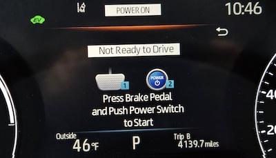
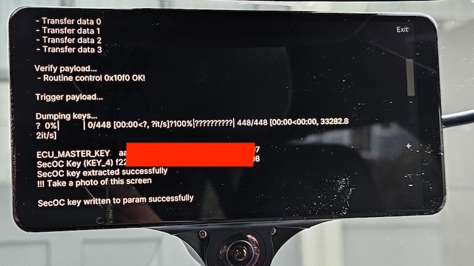
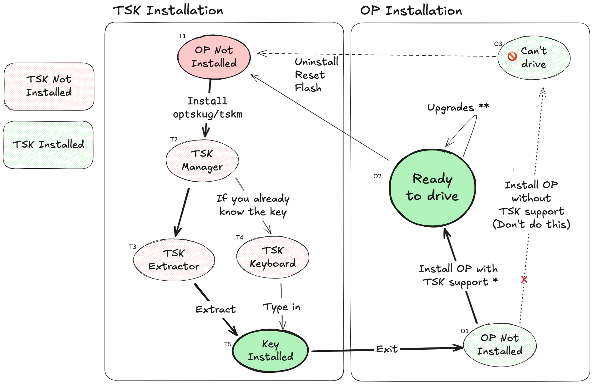

# openpilot/etc. on Toyota/Lexus/Subaru with TSK/ECU SECURITY KEY/SecOC

[^1]

[*Toyota's Sword in Rock situation*](https://store.steampowered.com/app/1865370/The_one_who_pulls_out_the_sword_will_be_crowned_king/) (that has been pulled out [quite a bit by Willem and Greg](https://icanhack.nl/blog/secoc-key-extraction/)!)

[](https://docs.google.com/spreadsheets/d/1sprUteWtCVH6nQ6JfsmX0liIJ58H4nAVWxtAdorfW4c/edit#gid=0&range=A1)[^2]

---

## Background

tl;dr: Toyota started to use cryptographical signatures to block openpilot (and other hacks). Some smart people in the industry hacked the signatures for _some_ cars, but not all cars.

openpilot, in order to control the steering or latitude, needs to be able to man-in-the-middle the steering control messages used by the lane keep assist system. It blocks the original steering control messages and replaces them with its own. This is done by the forward-facing camera, which is also known as the "Forward Recognition Camera" or "Object Recognition Camera" in Toyota vehicles. The camera is responsible for the lane keep assist in Toyota vehicles.

There is a `STEERING_LKA`-ish message and more in some new Toyotas that currently has an "authentication code" scheme appended to the end. The algorithm and security system for this "authentication code" is somewhat known for certain vehicles but requires a key that is unique to each vehicle to be extracted or smuggled out of the vehicle (https://icanhack.nl/blog/secoc-key-extraction/). Not all vehicles are able to have their keys extracted with what is currently known. Without the key or knowledge of the system, third parties like comma and users cannot control the vehicle. While vehicles that have had their keys smuggled out are currently working with openpilot.

---

## Cars

### 🟢 Successfully running openpilot

These cars can run openpilot but are not listed on https://comma.ai/vehicles or [CARS.md](https://github.com/commaai/openpilot/blob/master/docs/CARS.md) because comma.ai (the company) understandably doesn't want to own the security key hacking process. Follow the [Setup Guide](#setup-guide) below and you'll have it working.

* 2021-2023 RAV4 Prime
  * Upstreamed into openpilot's master branch.
* 2021-2023 Sienna Hybrid
  * Upstreamed into openpilot's master branch.
* 2020-2022 Yaris Hybrid (EUDM/JDM/MXDM)
  * Memory dump hack works but the key is not in the same address as RAV4 Prime.
  * Brute force efforts to find key location successful on both European and Japanese Yaris Hybrid. European user eventually gave up full installation due to unrelated C3 malfunction.
  * openpilot working with heavy hacked out [branch](https://github.com/nelsonjchen/openpilot/commits/yaris-gon/)
  * First Continental Radar + Camera setup going and thus first radar controlled ACC vehicle done with. This does not mean longitudinal is controlled by openpilot though.
  * Not sold in the USA, but is in Australia, Japan, and Europe
  * Only one guy using it in Japan, unfortunately. Help double the population!

#### Notes

* These vehicles have TSS 2.0.
* These vehicles do not use the HSM.
* These all seem to share the commonality of a ~~version 1 bootloader~~[^4] ? on the EPS
* Longitudinal
  * Some people seem to have it going. It is a [work in progress in getting it upstreamed to comma's codebase](https://github.com/commaai/opendbc/pull/1385).
  * Resume command spams still works from existing implementation so stop and go without touching is active if openpilot is active.

### 🟡 May be possible to hack but hasn't been tried

If you have one of these cars, please stop by the [comma Discord](https://discord.comma.ai)'s #toyota-security channel - we need more information from people like you.

* 2023 US-made Corolla (VIN starts with `5`)
  * Uses TSS 3.0 but does not appear to have ECU Security Key or SecOC steps when replacing the forward camera. It's unknown whether it has TSK, and if yes in what form. Maybe they just don't do the pairing thing but hardcode a key. No one knows.
* 2021+ Yaris Cross Hybrid (EUDM/JDM/MXDM)
  * Brute force script may work.
* 2021+ GR Yaris (EUDM/JDM/MXDM)
  * TSS 2.0
  * Brute force script may work.
  * Seems externally similar to Yaris Hybrid?
  * Would be the first manual transmission.

### 🔴 Not hacked and can't run openpilot

Car hackers, we need your help with these.

* 2022+ Aygo X (EUDM)[^3]
* 2023+ Aygo X (Euro tech info Lookup)
* 2023+ bz4x[^3] (Probably the same for sister rebranded Subaru Solterra)
* 2025+ Camry[^3]
* 2023 TMC/JP-made Corolla[^3]
* 2022+ Corolla Cross (USDM, not applicable to Thailand or Brazil)[^3]
* 2023 Corolla Cross Hybrid
  * TSS 2.0
  * Known to be not working.
  * Memory can be dumped but the key is not in visible memory.
  * Mentioned in Willem's blog post.
* 2024+ Corolla, All origins.
* 2023+ Crown
* 2024+ Grand Highlander ICE and Hybrid[^3]
* 2024 Highlander ICE and Hybrid
  * TSS 2.0
  * Known to be not working.
  * Memory can be dumped but the key is not in visible memory.
  * 02 ~~bootloader~~[^4]
* 2025+ Highlander ICE and Hybrid[^3]
* 2024+ Mirai[^3]
* 2023+ Prius and Prius Prime[^3]
* 2024+ RAV4 Prime
  * TSS 2.0
  * Key at least not at the same location as other RAV4 Prime
  * Brute force efforts to find key location TBD
  * At least code is executed. Unknown what might have changed.
  * New 02 ~~bootloader~~[^4] seen
* 2024+ RAV4 in Europe (techinfo)
* 2023+ Sequoia (Speculated from being a Tundra with an SUV Body)
* 2024+ Sienna
  * TSS 2.0
  * Key at least not at the same location as other RAV4 Prime
  * Brute force efforts to find key location TBD
  * At least code is executed. Unknown what might have changed.
  * New 02 ~~bootloader~~[^4] seen
* 2024+ Tacoma[^3]
* 2022+ Tundra (Confirmed in https://github.com/commaai/openpilot/issues/27869#issuecomment-1504046497)
  * TSS 2.0
  * No known ~~bootloader~~[^4] exploit execution
  * User ThisGuy has an extra rack on the bench. No known progress.
  * 04 ~~bootloader~~[^4]
* 2021+ Venza
  * Key at least not at the same location as the RAV4 Prime
  * Brute force efforts to find key location TBD
  * Has a 02 ~~bootloader~~[^4] though from one sample. Strange for this vintage? Maybe another should try.
* 2024+ Lexus GX[^3]
* 2022+ Lexus LS, LX, NX[^3]
* 2023+ Lexus RX, RZ[^3]
* 2024+ Lexus TX[^3]

### Unknown

If your car is not listed above, then there has been no documented information or attempts. Please talk to us at the [comma Discord](https://discord.comma.ai)'s #toyota-security channel.

---

# Setup Guide

* [Key Extraction](#key-extraction) if you don't know the key.
* [Key Installation](#key-installation) if you know the key.

> [!NOTE]
> The key will change if you get a new bumper, because the bumper has distance sensors that use the security key. Instead of applying the existing key to the bumper, they replace the key on all parts of the car. The same goes for many other parts with secoc components.
>
> If you never get into an accident, then the key will never change, unless a Toyota service technician presses a wrong button.


## Key Extraction

Your car has a security key that Toyota doesn't want you to have. \
Follow this guide to run a [hardware exploit](https://icanhack.nl/blog/secoc-key-extraction/) to extract the key.

### Step 1. Upgrade AGNOS by installing `commaai/master-ci`

AGNOS is the operating system used in C3X. The latest one is needed to run TSK Manager.

1-1. At home, turn on C3X with your phone charger. Ignore the low voltage warning. USB A-to-C cables work well, and USB PD (Power Delivery) sometimes doesn't work. If all fails, you can do this in your car.

1-2. Connect C3X to your Wi-Fi network.

1-3. Install `Custom Software` with URL `commaai/master-ci`

The installation takes 10~20 minutes with one or two restarts. This is longer than usual because `commaai/master-ci` is not precompiled.

1-4. Scroll and accept the EULA, and go through the training.


### Step 2. Install the hardware

2-1. Go to your car.

2-2. Connect the harness to your car by following the official Setup Guide: https://comma.ai/setup/comma-3x

2-3. Connect Comma Power (OBD2 connector + long cable) to make sure C3X stays powered on while turning the car on and off. You can remove it later but connect it for now.

2-4. Connect the right-angled OBD-C cable to the harness.

> [!WARNING]
> * The car harness sends a 12V signal instead of the usual 5V. Do not plug in anything other than C3X.
> * For connecting C3X to the harness, always use the right-angled OBD-C cable that came with the C3X.
> * comma.ai sells it if you need more: https://comma.ai/shop/obd-c-cable
> * If you must buy your own, USB-C 3.1 Gen 2 is required.

2-5. Connect the OBD-C cable to C3X to see that it powers on. Turn the car on and off - C3X should remain powered on.

### Step 3. Put the car into `Not Ready To Drive` mode

Some cars refer to `Not Ready To Drive` mode as `IGNITION ON` mode while others refer to it as `POWER ON` mode. Regardless of what your car calls it, get on the mode that says `Not Ready To Drive`.

 

Slowly press the `POWER` button twice WITHOUT pressing the brake pedal.
* The first press turns on `ACCESSORY` mode.
* The second press activates `Not Ready To Drive` mode.

### Step 4A. Run the exploit using `TSK Manager`

> [!NOTE]
> This is the recommended method for new users. See Step 4B for an alternate method.

4A-1. Uninstall openpilot (AGNOS will remain upgraded).

⚙️ > `Software` > `Uninstall openpilot` > `UNINSTALL` > `Uninstall` > `Confirm` > `Confirm`

4A-2. Connect C3X to Wi-Fi and install `Custom Software` with URL `optskug/tskm` to download `TSK Manager`. It will stay at 92% and then 100% for a few minutes as it installs.


4A-3. Run `TSK Extractor`. The car may beep and flash LKAS & Power Steering errors.

> [!TIP]
> Relax. The exploit is safe to run and can't break your car even if you yank the cable.
>
> If you want to quit, turn off the car, unplug C3X, and turn the car back on. Everything will be back to normal.

When you see the output, always scroll to the bottom of the text to see the result and what to do next.

4A-3-1. In case of a known error, it'll tell you to retry.


4A-3-2. In case of an unknown error, it will tell you to send @calvinspark a photo.


The exploit is proven to work but `TSK Extractor` GUI is new. Send @calvinspark a photo and then try again.

4A-3-3.  If you tried the extractor 3 times for 3 car restarts (=9 times) and still doesn't work, stop and talk to us in #toyota-security.

4A-3-4.  If it was successful, it'll tell you to take a photo.


This 32 digit hexadecimal number is your key (second redacted line).
> SecOC Key (KEY_4) **0123456789abcdef0123456789abcdef**

Congratulations, you have the key now!

As a bonus, the key was installed in `/data/params/d/SecOCKey` file and archived in `/cache/params/SecOCKey` file.

> [!WARNING]
> It's theoretically possible for someone to remotely hack your car with the key under very specific circumstances. You don't need to protect the key like it's your bank password, but still don't post it on Discord.

4A-4. Exit `TSK Extractor` and exit `TSK Manager`. C3X will reboot.

4A-5. Install `Custom Software` with URL `commaai/master-ci`

> [!CAUTION]
> `commaai/master-ci` is the only branch from comma.ai that supports TSK vehicles.
>
> If you install a branch without TSK support, openpilot won't be able to drive your car. If you uninstall the openpilot from the wrong branch, **the key also gets uninstalled**.

#### Review

We did T1, T2, T3, T5, O1, and O2 together. If you installed a wrong branch, then you also did O3.



* `commaai/master-ci` is the only branch from comma.ai <code>with TSK support<sup>*</sup></code>.

* Most <code>Upgrades<sup>**</sup></code> are safe, but it's also possible for an upgrade to uninstall the security key.

### Step 4B. Run the exploit using SSH manually

> [!NOTE]
> Even if you already extracted the key using `TSK Manager`, setting up SSH access will help you later with the key installation. It's not hard to do so follow along.
>
> If you want to do just the bare minimum and come back to this later, then skip over to Step 5.

### Step 4B-1. SSH into the device

4B-1-1. Set up SSH

Do this: https://github.com/commaai/openpilot/wiki/SSH#before-you-start

And then do one of these:
* macOS: https://github.com/commaai/openpilot/wiki/SSH#option-2mac---pre-installed-openssh-client-on-macos
* Windows: https://github.com/commaai/openpilot/wiki/SSH#option-2---pre-installed-openssh-client-on-windows-10-and-up

4B-1-2. SSH into the device.
```sh
ssh comma@"your Comma IP"
```

### Step 4B-2. Extract the security key

4B-2-1. Navigate to openpilot directory.
```sh
cd /data/openpilot
```

4B-2-2. Clone Willem's secoc Git repository.
```sh
git clone https://github.com/I-CAN-hack/secoc
```

4B-2-3. Navigate to secoc directory.
```sh
cd /data/openpilot/secoc
```

4B-2-4. Kill openpilot process.
```sh
pkill -f openpilot
```

C3X will display a splash screen with Comma logo.

4B-2-5. Run the key extraction script.
```sh
./extract_keys.py
```

> [!Tip]
> If you restarted C3X, be sure to run `pkill -f openpilot` on each C3X restart before running `./extract_keys.py`.

If you see something like this, the key extraction was successful.
```sh
comma@comma-71b93b83:/data/openpilot/secoc$ ./extract_keys.py
INFO: connecting to panda 2c0004004450383632311333
Getting application versions...
 - APPLICATION_SOFTWARE_IDENTIFICATION (application) b'\x018965B4509100\x00\x00\x00\x00'
 - APPLICATION_SOFTWARE_IDENTIFICATION (bootloader)  b'\x01!!!!!!!!!!!!!!!!'

Security Access...
 - SEED: 36552fe27172c99222eec3a9b9bd1f28
 - KEY: b7b55ba16369bba912b7aa4c06e6c35e
 - Key OK!

Preparing to upload payload...
 - Write data by identifier 0x201 00000000000000000000000000000000
 - Write data by identifier 0x202 00000000000000000000000000000000

Upload payload...
 - Request download
 - Transfer data 0
 - Transfer data 1
 - Transfer data 2
 - Transfer data 3

Verify payload...
 - Routine control 0x10f0 OK!

Trigger payload...

Dumping keys...
100%|████████████████████████| 448/448 [00:00<00:00, 14293.36it/s]

ECU_MASTER_KEY    82667ef509b9f07a134aaf89d4973c68
SecOC Key (KEY_4) 0123456789abcdef0123456789abcdef

SecOC key written to param successfully!
comma@comma-71b93b83:/data/openpilot/secoc$
```

This 32 digit hexadecimal number is your key.
> SecOC Key (KEY_4) **0123456789abcdef0123456789abcdef**

Archive and don't lose the key so that you don't need to extract it again. Perhaps email it to yourself.

> [!WARNING]
> It's theoretically possible for someone to remotely hack your car with the key under very specific circumstances. You don't need to protect the key like it's your bank password, but still don't post it on Discord.

### Step 4B-3. Debugging

#### 4B-3-1. If you see any of these error messages

* `panda.python.uds.MessageTimeoutError: timeout waiting for response`
* `panda.python.uds.InvalidServiceIdError: invalid response service id: 0x50` or similar
* `Can't read application software identification. Please cycle ignition.`

Turn off the car, put it back into `Not Ready to Drive` mode, and then try again.

Be sure to kill openpilot process if you restarted C3X.

#### 4B-3-2. `Unexpected application version!`

* Open the script for editing.
  ```sh
  nano -l /data/openpilot/secoc/extract_keys.py
  ```

* Comment out lines 78 and 93 by adding a `#` at the beginning of each line.
  ```python
  if app_version not in APPLICATION_VERSIONS:
      print("Unexpected application version!", app_version)
  #    exit(1)
  ```
  ```python
  if bl_version != APPLICATION_VERSIONS[app_version]:
      print("Unexpected bootloader version!", bl_version)
  #    exit(1)
  ```

* Save and exit the editor (`Ctrl+X`, then `Y`, then `Enter`).

* Kill openpilot process and run the script again.
  ```sh
  pkill -f openpilot

  ./extract_keys.py
  ```

#### 4B-3-3. Still doesn't work?

Turn off the car, unplug everything, plug them back in, and try again.

### Step 4B-4. Install the security key & Reboot

4B-4-1. Install the key.
```sh
echo -n "your key here" > /data/params/d/SecOCKey
```

For example,
```sh
echo -n "0123456789abcdef0123456789abcdef" > /data/params/d/SecOCKey
```

4B-4-2. Archive the key, so that it doesn't get deleted when openpilot is uninstalled.

Make the archive directory with correct permissions.
```sh
sudo mkdir -p /cache/params || true
sudo chown comma:comma /cache/params
```

Archive the key.
```sh
echo -n "0123456789abcdef0123456789abcdef" > /cache/params/SecOCKey
```

4B-4-3. Reboot the device.
```sh
sudo reboot
```

### Step 5. Fingerprinting (if the car is not recognized)

> [!NOTE]
> If C3X reboots into the 15mph calibration screen, skip to Step 6.
> If it says something like `Car unrecognized` or `Dashcam mode for unsupported car`, continue on Step 5.

5-1. Follow the fingerprinting guide to get the ECU codes: https://github.com/commaai/openpilot/wiki/Fingerprinting

5-2. Add the ECU codes to `fingerprints.py`.

* Open the file for editing.
  ```sh
  nano /data/openpilot/selfdrive/car/toyota/fingerprints.py
  ```

* Scroll down to the `CAR.TOYOTA_RAV4_PRIME` section.

* Add your corresponding ECU codes:
  ```python
  },
  CAR.TOYOTA_RAV4_PRIME: {
  (Ecu.engine, 0x700, None): [
    b'\x01896634AJ7000\x00\x00\x00\x00',
    b'\x018966342S7000\x00\x00\x00\x00',
  ],
  (Ecu.abs, 0x7b0, None): [
    b'\x01F15264284100\x00\x00\x00\x00',
    b'\x01F15264228300\x00\x00\x00\x00',
  ],
  (Ecu.eps, 0x7a1, None): [
    b'\x018965B4233100\x00\x00\x00\x00',
    b'\x018965B4209000\x00\x00\x00\x00',
  ],
  (Ecu.fwdRadar, 0x750, 0xf): [
    b'\x018821F6201300\x00\x00\x00\x00',
    b'\x018821F3301400\x00\x00\x00\x00',
  ],
  (Ecu.fwdCamera, 0x750, 0x6d): [
    b'\x028646F4210100\x00\x00\x00\x008646G3305000\x00\x00\x00\x00',
    b'\x028646F4205200\x00\x00\x00\x008646G4202000\x00\x00\x00\x00',
  ],
  ```

* Save and exit the editor (`Ctrl+X`, then `Y`, then `Enter`).

5-3. Optionally disable updates, because an update will delete the manually added fingerprints.
* If your fingerprints were upstreamed, then the next update will contain your fingerprints, so don't disable.
* If your fingerprints were not upstreamed, disable.
  ```sh
  echo -n "1" > /data/params/d/DisableUpdates
  ```
* If you're using FrogPilot, disabling update causes an `updated` error, so don't disable.

5-4. Reboot the device.
 ```sh
 sudo reboot
 ```

### Step 6. Calibrate & Clean up

If you're able to calibrate and then use openpilot to use the steering wheel (aka "lat support"), you can clean up the cables and put the covers back on.

At this time, `commaai/master-ci` branch can't use the gas and brake pedals (aka "long support") on TSK vehicles. Monitor these PRs for long support progress (https://github.com/commaai/opendbc/pull/1385 & https://github.com/commaai/panda/pull/2061). Experimental mode is also not supported.

Comma Power (OBD2 connector + long cable) is optional. It's not necessary for using C3X, but keeping it allows C3X to stay powered on when you turn off the car, which allows you to upload logs and SSH in more easily. [If you do this, you'll be in the training set and your specific driving will improve faster than others.](https://discord.com/channels/469524606043160576/954493346250887168/1328801037578145802)

## Key Installation

### When to do this
The security key gets uninstalled when
1. openpilot is uninstalled,
2. comma is reset (tap-tap-tap on the boot screen), or
3. comma is flashed (flash.comma.ai).

Follow this guide to reinstall the key that you already have.

### Method 1. Use the built-in `TSK Manager`/`TSK Keyboard`

Some forks/branches have `TSK Manager` or `TSK Keyboard` under Settings.

⚙ > `Device` > `TSK Manager`/`TSK Keyboard`


If it's there, use it to type in your key and install, and then reboot.

### Method 2. SSH and install the key to `/data/params/d/SecOCKey` file

### Step 2-1. SSH into the device

2-1-1. Set up SSH

Do this: https://github.com/commaai/openpilot/wiki/SSH#before-you-start

And then do one of these:
* macOS: https://github.com/commaai/openpilot/wiki/SSH#option-2mac---pre-installed-openssh-client-on-macos
* Windows: https://github.com/commaai/openpilot/wiki/SSH#option-2---pre-installed-openssh-client-on-windows-10-and-up

2-1-2. SSH into the device.
```sh
ssh comma@"your Comma IP"
```

### Step 2-2. Install the key and reboot
```sh
echo -n "your key here" > /data/params/d/SecOCKey
```

For example,
```sh
echo -n "0123456789abcdef0123456789abcdef" > /data/params/d/SecOCKey
```

And then reboot the device.
```sh
sudo reboot
```

### Method 3. Uninstall openpilot, install the key using `TSK Manager`, and install openpilot

This is the workflow for using `TSK Manager` to install the security key, which is the same as the key extraction process.

The only difference is that instead of T3, you'll do T4.


#### Step 3-1. Same as Key Extraction

Go back to [Key Extraction](#key-extraction) and start again from Step 1.

#### Step 3-2. Except for Step 4A-3

When you get to Step 4A-3, don't run `TSK Extractor` but instead run `TSK Keyboard`.


Use it to type in your key and install.

#### Step 3-3. Again, same as Key Extraction

Go back to Step 4A-4 and then finish with Step 4A-5.

---
## Forks
### Which Fork Should I Use?
> [!WARNING]
> If you have to ask, you're not ready for forks.

Begin your research in Discord #custom-forks

Please do not ask about forks outside of that channel.

Please start with `commaai/master-ci`. This is the latest upstream and supports lateral only. 

> [!WARNING]
> Some forks will brick your C3X. \
> Most forks are not made for C3X because C3X is less than a year old.
> 
> Some forks contain banned code. \
> Using it will get you banned by the comma.ai company.
> 
> Some forks have nudgeless-lane-change. \
> Simply clicking the turn signal will move your car to the next lane. \
> Without any checks. \
> Yes, it will drive into the car next to you.
> 
> Some forks play a blood-curdling goat scream at max volume randomly.
> 
> The danger in using forks is not theoretical because it has full control over your car.
> 
> There's a real and present danger in using forks, even on the most popular forks.

If you acknowledge the warning above and are still looking to try a fork that supports TSK the following are available to install at your own risk. Please keep in mind that these are community maintained and may not stay up to date:

#### Forks with Long
* `alexandresato/personal3`
  * A.K.A SatoPilot, the first fork to support TSK long!
  * Very quick stop-and-go response
  * Includes TSK key extract button
* `chrispypatt/sunnypilot`
  * Chrispypatt's fork of SunnyPilot's in-progress rewrite. 
  * Maintained as best effort. This may not always be up to date with latest SunnyPilot. Reach out to @Chrispypatt for requests to rebase his fork with SunnyPilot's re-write if it is out of date.
  * Includes a TSK keyboard with key caching
  * Model switcher to easily switch between various models
#### Forks with Lateral Only
* `optskug/SiennaFP`
  * @anbuck's old fork of FP and first fork to support TSK lateral!
  * Uses an old AGNOS version. When downgrading, OP may get stuck in a registration loop. In this case, tap-tap-tap on the boot logo and reset the device to recover and then install again.
---

## Bounty Statuses

### 🗳️ comma.ai Vote for Toyota Security

In June 2022, comma.ai created a paid vote/crowdfund for making openpilot support Toyota Security. Once they get 500 votes at $100 a vote, they have 6 months to figure it out and open source a solution; Otherwise, a refund will happen and all the money is returned. The current status of that was: [)](https://docs.google.com/spreadsheets/d/1GOeN2ph9JLvOlwStZso988YPT-lILl7yZqFW8UPCFZM/edit#gid=0&range=B1)[^2] .

Vote counts were reported every week or similar and are recorded in this spreadsheet by the community:
https://docs.google.com/spreadsheets/d/1GOeN2ph9JLvOlwStZso988YPT-lILl7yZqFW8UPCFZM/edit#gid=0

The result of this vote, even though it has not met its target cost, is [a pull request was produced for the RAV4 Prime to be supported in openpilot](https://github.com/commaai/openpilot/pull/31179). It was eventually merged in.

In January, the vote page was taken down. Below is a snapshot.


The last known vote count from community observations:

[](https://docs.google.com/spreadsheets/d/1GOeN2ph9JLvOlwStZso988YPT-lILl7yZqFW8UPCFZM/edit#gid=0&range=BulkVoteCount)[^2]

In addition to their vote system, comma also has/had specific bounties up:

* ["$5k if someone cracks it and upstreams RAV4 prime support -geohot (link currently broken)](https://discord.com/channels/469524606043160576/524328425415245827/839289683489062952)
  * Currently locked to Willem for Willem's PR for the RAV4 Prime to merge in completely: https://github.com/commaai/openpilot/pull/32661#issuecomment-2156220468
  * Likely paid out.
* [We're announcing a bounty for the 2023 Corolla, 2023 Corolla Hybrid, and 2023 Prius. $500 for a working port merged.](https://discord.com/channels/469524606043160576/954493346250887168/1082390596544639086)

### 👥 Communities Bounty

The overall community bounty has been canceled for numerous reasons:

https://www.reddit.com/r/Comma_ai/comments/1d5r7xr/comment/l6vjf9e/

Original Sheet: https://docs.google.com/spreadsheets/d/1MKS78_utvbAe74Xv7zszgEnn6JrtBgpgYlVOfoIvLEw/edit#gid=0

In its place are more specific community bounties:

* Tundra Interest Group
  * [~~"I’ll put up 2k for Tundra alone" - bgill66~~](https://discord.com/channels/469524606043160576/905950538816978974/1243275998745722911)
    * Scrubbed / User had bumped to $5k but there was no interest. https://discord.com/channels/469524606043160576/905950538816978974/1259282479257485383

## Pictures of TSK'd and non-TSK'd Camera ECUs

FWIW the outside of the ECU Security Key camera of a Rav4 Prime looks the same as a non-ECU Security Camera of a Corolla or Corolla Hatchback.

2021 Rav4 Prime:


Security Key'd Denso innards: https://discord.com/channels/469524606043160576/905950538816978974/939203494152372274

2020 Corolla/Corolla Hatchback:


A photo teardown of the 2020 Corolla camera (NON ECU SECURITY KEY) innards: https://photos.app.goo.gl/qsBaMFT6PSEs7BFXA

# Current History

Here's a brief to get anybody going into this ECU Security Key issue up to speed. I'll keep updating this with links to the relevant Discord messages and other stuff as I find them.

Discord links may be linking to the middle of the conversation. Scroll up and down for context.

Many of these Discord links are to a pre-hidden channel named `#toyota-security` in the  comma.ai Discord. Accessing `#toyota-security` on comma.ai Discord requires completing the simple prompt in `#join-development`. Otherwise, it is inaccessible. More often than not, the Discord links are to `#toyota-security` in the comma.ai Discord, so please complete the prompt.

Most if not all Discord links are to the comma.ai Discord accessible with an invite from https://discord.comma.ai unless otherwise noted. These other Discords include:

* Retropilot (RP): https://discord.gg/GzWegVa.
* Sunnypilot's Openpilot Server (SP): https://discord.gg/TCTvFTKrAV.
* Openpilot Enthusiasts (Formerly "Openpilot community") (OPC): https://discord.gg/rRB7eDKccy
* MoreTorque (MT): https://discord.gg/439DM9KJ4r
* Frogpilot (FP): https://github.com/FrogAi/FrogPilot?tab=readme-ov-file#discord

The activities, actions, and discussions on non-comma.ai Discords are/may not supported by or affiliated with comma.ai (this may even apply even to the comma.ai Discord too). In the case of MoreTorque, comma.ai is strongly opposed to that community/Discord. That said, the ECU Security Key issues affects all and relevant events and information may be there as well.


## Background

For Toyota openpilot enthusiasts, the community was very excited for the RAV4 Prime, a high performance Toyota that was going to have "Toyota Safety Sense 2" (TSS2), other awesome Toyota traits such as reliability, utility, and economy, and, new for a Toyota SUV, speed. It is the fastest accelerating real Toyota excluding Lexuses as the Supra, a BMW badged as a Toyota, does not count.

Previously seen TSS2 vehicles have had an architecture where both latitude and longitudinal are both controlled by the front-facing camera. openpilot was able to intercept and control latitude and longitudinal all at the front-facing camera of TSS2 vehicles, promising full openpilot capabilities. No other taps in the CAN of the vehicle were needed to control or block messages for this capability.

The typical process for adding a new TSS2 vehicle is simply creating a fingerprint with reference to the closest similar vehicle and trying it out.

## Timeline

### 2013

* [IOActive experiments with injecting packets to steer a Prius in a widely disseminated and seminal security assessment. Their research around this time also led to them being able to **remotely** inject through the radio with a FCA vehicle and cause it to steer. In an unwise move, they demonstrated this in the middle of a busy highway. Anyways, not great.](https://www.youtube.com/watch?v=qX0rRRUdOKU)
  * This is way in the past, but it's important to note that even large slow dinosaurs or turtles _move_ and it's been a few years.

### August 2020

matty#8553 came on Discord as the first user with a RAV4 Prime and a new Comma 2. crazysim#7797 / @nelsonjchen offered to get the RAV4 Prime supported. [Some worrying observations were immediately made in a GitHub issue after validating that the hardware was sound and working on another non-Prime TSS2 RAV4 ](https://github.com/commaai/openpilot/issues/2103):

* The `STEERING_LKA` CAN message is now 8 bytes in size. Existing TSS2 vehicles had a 5 byte `STEERING_LKA` CAN message.
  * There is a 4 byte authentication code on the CAN message instead of the simple 1 byte checksum of past Toyotas.
* [@nelsonjchen implemented and tried many checksum algorithms to try and create an identical `STEERING_LKA` message to what was seen in Cabana](https://github.com/nelsonjchen/toyota_checksum_2020_scratch/blob/8422bd3b4b7770391e940d31202b8129fdebcb02/src/lib.rs#L97-L108). None of them worked.
* @nelsonjchen asked around on many Discords and other well-known users for help. No one was able to help.
* @nelsonjchen notices that the "checksum" is the not the same for messages with the same data. It doesn't seem like a checksum. Maybe some other state is kept somewhere?
* The authentication code messages change between ignitions.
* The messages are different between vehicles.
* The same inputs result in different "checksum"/authentication code outputs.
* [@nelsonjchen notices that Toyota filed a patent about message authentication on the CAN bus.](https://discord.com/channels/469524606043160576/524327905937850394/749576060110241824)
* [matty#8553 eventually returned the Comma 2 within the trial period.](https://discord.com/channels/469524606043160576/524327905937850394/793525907763363901)

### October 2020

* [geohot offers to take a look at a RAV4 Prime in-person if someone makes the drive to San Diego](https://www.youtube.com/watch?v=JQxAGhhflDc&t=37m23s)
* [aka#2674 starts trying to look at the issue on their own RAV4 Prime. aka#2674 is able to capture some traffic of some sort from Toyota's Techstream diagnostic tool of both the CAN bus kind and the server traffic.](https://discord.com/channels/469524606043160576/524327905937850394/763998197507948564)

### November 2020

* [aka#2674 bought another RAV4 Prime camera ($800!) to take a look at and to see how the reprogramming works.](https://discord.com/channels/469524606043160576/524327905937850394/772718083798335521)
* aka#2674 moved to San Diego area

### December 2020

* [James-T1 takes a look at ECU Security in Toyota's TechInfo site. The Sienna and Venza are discovered to be additionally affected vehicles.](https://discord.com/channels/469524606043160576/524327905937850394/793229962869604382)
* Support for the Camry with TSS 2.5 was added around this time. It did not have ECU Security Key. TSS versioning does not appear to be correlated with ECU Security Key presence.

### January 2021

* [@nelsonjchen makes the bounty spreadsheet in Discord inspired by the recent success of the Honda 10th Gen Accord Bounty.](https://discord.com/channels/469524606043160576/524327905937850394/803436044028215316)

### February 2021

* [Willem Melching of comma.ai took a deeper interest and posted on Discord](https://discord.com/channels/469524606043160576/524327905937850394/808639016266235975). He is waiting for parts from  affected vehicles to show up on part or junkyard sites for bench analysis.
* [The NHTSA had posted a PDF from Toyota about ECU Security Key and how to reconnect an ECU replacement such as a camera and so on using ECU Security Key to a vehicle. In summary, Techstream users must connect to the Techstream backend for keys.](https://static.nhtsa.gov/odi/tsbs/2020/MC-10184541-9999.pdf)

### March 2021

* [TheReaper#0283 posts about looking at the issue as part of his day job. TheReaper#0283's day job appears to be reverse engineering and creating an alternative Yaris GR ECU for racing purposes. A diagram and hint that the ECU Security Key implementation is likely an AUTOSAR implementation is provided along with some guidance as to the architecture of the implementation.](https://discord.com/channels/469524606043160576/524327905937850394/826016337142480906)
  * 
  * The relevant AUTOSAR documentation the diagram was pulled from is here: https://www.autosar.org/fileadmin/user_upload/standards/classic/4-3/AUTOSAR_SWS_SecureOnboardCommunication.pdf
* [@nelsonjchen and many others in the #toyota-lexus community decide to create an additional Firmware Dump milestone bounty as it is generally something that appears to be required. We simply do not know the exact details of the authentication system such that even if we capture the key programming commands, we do not know how to use the values.](https://discord.com/channels/469524606043160576/524327905937850394/826013930493050891)
  * Also known as SecOC.

### April 2021

* [Mutley#1114 takes an interest in the issue. Mutley#1114 is able to record a CAN log and observe that Toyota Techstream writes a local XML file to the disk with part of the keys before contacting the backend.](https://discord.com/channels/469524606043160576/524327905937850394/834765270840770561)
* [Daniel Farley#9948 brings in a Yaris GR from New Zealand. It has ECU Security Key. Possible offer of some parts from another rally converted Yaris GR for reverse engineering.](https://discord.com/channels/469524606043160576/524327905937850394/834576493325713408)

### May 2021

* [ayau#2654 and MD1000#7505 work together to take a look at MD1000#7505's 2021 Sienna. It definitely has ECU Security Key.](https://discord.com/channels/469524606043160576/524327905937850394/842903140030611466)
* [geohot, CEO of comma.ai, adds $5000 to the ECU Security Key bounty with some important clean-room stipulations.](https://discord.com/channels/469524606043160576/524328425415245827/847528122793590784) The [bounty](https://docs.google.com/spreadsheets/d/1MKS78_utvbAe74Xv7zszgEnn6JrtBgpgYlVOfoIvLEw/edit#gid=0) at this point is now about $8000 with $3000 from the non-comma.ai portion of the community.

### June 2021

* [ayau#2654 discovers a video about an alternative ECU for the Yaris GR. It discusses that the camera doesn't work in this setup. @nelsonjchen suspects it's TheReaper#0283 in the video.](https://discord.com/channels/469524606043160576/524327905937850394/850804871127891968)

### July 2021

* [wocsor#0313 takes an interest in the issue and @nelsonjchen briefs him on the situation and current public observations. wocsor#0313 puts out an open offer to affected owners in the ATL area to spend some time to make some observations with his hardware but unfortunately, no one on the spreadsheet is from around the ATL area.](https://discord.com/channels/469524606043160576/524327905937850394/870149096894255144)
  * We'll message him if and when someone in ATL does appear. Of course, if you have an affected vehicle and are in ATL, please get in contact with us!

### August 2021

* Comma 3 is released at comma Con.
  * [At the Comma Team Group Chat, Erich, a prominent Toyota community contributor and community Discord moderator, asked about ECU Security Key:](https://youtu.be/qTaPD0l_8PM?t=23390)
    * Adeeb: I think we'll just look into it a bit and just kind of understand what the scope of the issue was and we just decided this isn't affecting too many cars yet that's not where we're choosing. We've aggressively chosen in the last year or so to not spend time on specific cars

       We've spent almost all of our time doing things that improve everybody's experience with openpilot.
       Now the comma three's out, maybe we can get back to doing stuff that helps some subset of the users but we've we've really been pushing on the experience that every user sees

       Hotz: I'm counting on the community for that one of you out there we put five thousand dollars of commas hard-earned money up.

* @nelsonjchen writes this timeline: https://github.com/commaai/openpilot/discussions/19932#discussioncomment-1123629

* [Tatsuya#9505 discovers an article from a reputable japanese technical publication discussing the use of AES and CMAC to secure ECUs by Toyota in response to attacks as seen on the Prius in 2013. (Archived Link)](https://web.archive.org/web/20210805040317/https://xtech.nikkei.com/atcl/nxt/column/18/00001/00161/)

* [Achilles308#2230 brings up PASTA, a security testbed that was produced by Toyota and a discussion happens over it.](https://discord.com/channels/469524606043160576/524327905937850394/872673279733800990)

* [cferra#1932 points out that the radar module is the same. Some discussion happens on if the radar communication may be authenticated and/or has modes to be in authentication mode. ](https://discord.com/channels/469524606043160576/524327905937850394/872750852358688778)

* [Mutley#1114, a leading hunter, elaborates on their attempts and believes that a firmware dump of an involved ECU such as the EPS is the only way to really determine what is going on. Mutley#1114 tried spoofing firmware versions. Unfortunately, Toyota only distributes firmware if there's another public firmware and no firmware is available to download from Toyota. This appeared to still be the case as of August 2021.](https://discord.com/channels/469524606043160576/524327905937850394/873993271574143056)

* [deagle50#5014 asks how a firmware dump might be done. crazysim#7797 gives the best answer he could but he isn't a hunter.](https://discord.com/channels/469524606043160576/524327905937850394/881940297108578344)

### September 2021

* [@nelsonjchen asks if aka#2674 may be willing to take pictures of the insides of their spare Rav4 Prime front camera for comparison to a non-ECU Security camera as the exteriors look the same. No immediate response so far.](https://discord.com/channels/469524606043160576/524327905937850394/883632739784478731)
* [EpiJunkie#1220 looked up TechInfo and confirms that the North American Corolla Cross has ECU Security Key](https://discord.com/channels/469524606043160576/524327905937850394/886733789353635871)
  * [In contrast, the Thailand Corolla Cross posts from tape#7233 posted in January 2021 do not mention ECU Security Key and AFAIK, tape#7233's Thai Corolla Cross is working.](https://discord.com/channels/469524606043160576/524327905937850394/804016804175282267)
* [EpiJunkie#1220 lists parts in a Rav4 Prime that are covered underneath ECU Security Key. Theoretically, dumping the firmware for some of these parts would help shed light on how the system works. **Bolded** are parts involved with OP latitude.](https://discord.com/channels/469524606043160576/524327905937850394/887755778012880926)
  - ECM
  - Hybrid vehicle control ECU
  - **Forward recognition camera**
  - No. 2 skid control ECU (brake actuator assembly)
  - **Rack and pinion power steering gear assembly**
  - Clearance warning ECU assembly
  - Steering sensor
  - Central gateway ECU (network gateway ECU)
  - Combination meter assembly
  - Airbag sensor assembly
* ["toyota encryption is a small segment right now. when it comes to corolla or prius we will prioritize" - geohot](https://discord.com/channels/469524606043160576/524328425415245827/889659628655345684)
* [After a small bit of confusion with some jank in Cabana, belm0#9067 determines that the CH-R Hybrid doesn't have ECU Security Key. However, the 2021 Yaris Cross Hybrid does.](https://discord.com/channels/469524606043160576/524327905937850394/892723021066944512)
* [(OPC Discord) kumar#2021
 mentions having dumped the Prius EPS firmware with the aid of a local friend in PHX. If the friend were to go for it, @nelsonjchen would have tried to arrange for a affected vehicle to travel to PHX. Unfortunately, the friend declined to help with dumping EPS Firmware from an ECU Security Key vehicle.](https://discord.com/channels/771493367246094347/771495215570747403/888052591504789584)

### October 2021

* [EpiJunkie#1220 lists the steps to get first-hand information on if a model has ECU Security Key on the forward recognition camera from TechInfo.](https://discord.com/channels/469524606043160576/524327905937850394/894262224552624228)
* Regarding offers by comma to take a look at owners of ECU Security Key vehicles in the SoCal area:
  * ["it’s been a while, but I believe all the people interested in coming down [to San Diego] weren’t comfortable with something experimental" - adeeb](https://discord.com/channels/469524606043160576/524327905937850394/896842676278800434)
  * [Rez (∩｀-´)⊃━☆ﾟ.*･｡ﾟ#2896
 replied interest with some times in SD but no replies were received from comma. ](https://discord.com/channels/469524606043160576/524327905937850394/900899681272496178)
* [eggs#7709 looks up the "yaris 2020 hybrid euro model" and it requires an ECU Security Key update when replacing the camera. It is believed that this also applies to the Australian model.](https://discord.com/channels/469524606043160576/524327905937850394/896984387344801843)
* [Ale Sato Brazil SP#5717 tries out OP on a Brazilian Corolla Cross and it works. That model from that region does not have ECU Security Key.](https://discord.com/channels/469524606043160576/524327905937850394/897182609371717652)
* [(OPC Discord) kumar#2021 sees a rather curious message on his head unit. There's an update to improve the Pre-Collision system on his TSS2 Prius?! In TSS2, the camera is very important to PCS. Up to this point, there has not been evidence of a camera update ever happening. If this does involve a camera update, maybe the firmware from the camera can be intercepted. Maybe this issue might affect firmware from an ECU Security Key vehicle as well. Very curious. ](https://discord.com/channels/771493367246094347/771495215570747403/900570141417426965)
  *  
  *  [(Comma.ai Discord) X-Post to comma.ai Discord. Mutley#1114 acknowledges this curiosity. ](https://discord.com/channels/469524606043160576/524327905937850394/900834516166389813)
* [Added @nelsonjchen's firmware dump milestone criteria](https://github.com/commaai/openpilot/discussions/19932#discussioncomment-1554882)

### November 2021

* [geohot creates a `#toyota-security `channel on Discord and makes a rough plan sketch to try to help the community (this channel is under the Development section of Discord, checkout `#join-development` if you don't see it):](https://discord.com/channels/469524606043160576/905950538816978974/905950733558513674)
  1. list all the ECUs that have the security
  2. find out what chips are in those ECUs. ideally we find a dumpable one without any hw security features
  3. dump the firmware!
  4. understand the algorithm/keys doing the encryption. at this point, openpilot will work if it's rekeyed.
  5. if possible, break the crypto. at this point, openpilot will just work
* [the comma team does have logs of the pairing process and is able to see some xml stuff with some unknown values labeled M1, M2, M3, and so on](https://canary.discord.com/channels/469524606043160576/905950538816978974/906082176305610812)
* Somebody on RP Discord claims a friend of theirs has used their OP hardware to crack the system with OP working on their 2021 Venza. They wish to stay anonymous/low at this time. They are not interested in releasing their work but could be interested in releasing it for the bounty amounts to be paid to a charity.
  * "Alright, here is what I understood from our convo. He said the ecu key is really important at lest the way he is doing. Without that ecu cannot community at all so op has no chance of working obviously. So he overwrite the original key with the new key that he generated in online portal. While the key is being sent to the car he does mitm to grab the handshake and duplicate and use that every time he wants to use op(he said something about hash being encrypted not sure what that was all about) . He also said he using using two panda and arduino. Asked him if he is interested in handing over his progress to comma so they can improve and make it better but he said no for now."
  * Added as "Mysterious Stranger" in bounty/interested user spreadsheet.

### December 2021

* [Somebody cross posts from RP Discord to comma.ai Discord what the RP Discord user and his mysterious friend claims. Lots of doubt as to veracity as other than the small explanation above, previously known info and not much new info or proof of working was shared. ](https://discord.com/channels/469524606043160576/905950538816978974/915068210481618944)
* The RP Discord user with the mysterious friend  leaves all OP communities due to harassment.
* [MBrownies#7412 orders a 2021 Sienna ECM ECU to try and dump. Seems to have some history in the past of some electronics repair knowledge](https://discord.com/channels/469524606043160576/905950538816978974/915643239141363732)
  * [Pictures](https://discord.com/channels/469524606043160576/905950538816978974/920412000234917908)
* [@nelsonjchen borrowing jokes#4106's TechInfo account sees that the 2022 Toyota Tundra has ECU Security Key on the Forward Recognition Camera](https://discord.com/channels/469524606043160576/524327905937850394/916155760352837692)
* [@nelsonjchen had a talk with wocsor. wocsor has since moved to Colorado. wocsor is still open for taking a look at a ECU Security Key Toyota especially on a weekend. Please hit us up if you're in Colorado.](https://canary.discord.com/channels/469524606043160576/524327905937850394/916901731282079764)
* [MBrownies#7412 starts an attempt to dump the firmware from a 2021 Sienna ECM ECU in #toyota-security.](https://discord.com/channels/469524606043160576/905950538816978974/918688294081003520)
* [MBrownies#7412 says there may be a firmware update for the 2021 Sienna ECM that may be interceptable. IceyJ#0001, the son of a 2021 Sienna owner, appears to be interested in intercepting the firmware with MBrownies#7412's assistance.](https://discord.com/channels/469524606043160576/905950538816978974/918768906183798844)
* [(RP Discord) eRock970#1675 mentions they go through Colorado in their Rav4 Prime to wocsor. wocsor's MITM idea was debunked but he's still game to try something.](https://discord.com/channels/660951518014341124/801610171641364500/922592221067345921)

### January 2022

* [Willem Melching from comma.ai posts a 4 part blog post about his own adventures in hacking a VW golf ECU including dumping and reverse engineering it on his own time.](https://blog.willemmelching.nl/carhacking/2022/01/02/vw-part1/)
* [IceyJ#0001 is planning to work with MBrownies#7412 on dumping something next month. IceyJ#0001 was delayed a bit by sickness and other issues.](https://discord.com/channels/469524606043160576/905950538816978974/932763692762800218)
* [#toyota-security discusses dumping the flash as seen on the LKAS forward camera](https://discord.com/channels/469524606043160576/905950538816978974/932839231406088252)
* [The Rav4 Hybrid 2022 doesn't work out of the box with fingerprinting. At first glance it looks like the radar changed and security key wasn't added.](https://discord.com/channels/469524606043160576/934541955818467379/936126765137555527)
* [(MT Discord) ryleymcc#4808 creates a #toyota channel in MT Discord and posts a request with offer of help/partnership to skilled hardware developers to develop a Toyota Torque Interceptor. When asked if this was a possible alternative to CAN MITM on Security Key Toyotas and referencing this discussion, ryleymcc#4808 claims it would circumvent all the Security Key issues.](https://discord.com/channels/839295599928934430/936051750639665172/936099944518025217)
  * NOTE: comma.ai strongly disapproves of ryleymcc#4808's work and operations, citing serious safety concerns.
  * This approach would likely not fulfill much of the bounty as it is currently specified as it is unlikely to make it into a release branch.

### February 2022

* [The Continental Radar on the 2022 Rav4 may indicate a return to Continental for Radars and Cameras. It's possible that some of these ECU Security Key vehicles have Continental Setups and not Denso setups. Further research might need to be done. ](https://discord.com/channels/469524606043160576/934541955818467379/937772568822317076)
* [VagueAscent#4842 posts pictures of the internals of a Denso Toyota Security Key Camera. It looks the same as a non-Toyota Security Key camera. This may mean the learnings from practicing dumping of a much cheaper and plentiful non-Security Key Camera may be helpful. ](https://discord.com/channels/469524606043160576/905950538816978974/939203494152372274)
* [wocsor#0313 says he heard the Dragonpilot people have cracked ECU Security Key. However, it'll require more hardware and Dragonpilot will be keeping their implentations closed-source.](https://youtu.be/OXlEKoCRmwk?t=1360)
  * [Discussion in #toyota-security. Rumor is two pandas and an arduino.](https://canary.discord.com/channels/469524606043160576/905950538816978974/939331758124593193)
* [zorrobyte#5330 discovers that the Rav4 Prime has the same steering rack as the Rav4 Hybrid. This may mean that the authentication is implemented at the gateway. zorrobyte#5330 suspects the rumored dragonpilot approach may be taking advantage of this and bypassing the gateway.](https://discord.com/channels/469524606043160576/905950538816978974/939392177144999967)
* [MBrownies#7412 says IceyJ#0001, who was going to help try to capture a relevant firmware dump together, has gone MIA.](https://discord.com/channels/469524606043160576/905950538816978974/942146323908550687)
* [wocsor#0313 says that a rack replacement on a Rav4 Prime requires re-keying anyway so maybe the communication here is authenticated anyway. Nevermind.](https://discord.com/channels/469524606043160576/905950538816978974/943268332436590602)
* [IceyJ#0001 returns. He's just been busy with life. Time may be found next weekend.](https://discord.com/channels/469524606043160576/905950538816978974/943733084552044625)
* [zorrobyte#5330 mentions that the key may be able to be force written. This probably means capture without having to swap cameras or something.](https://discord.com/channels/469524606043160576/905950538816978974/943519475129520128)
* [Mutley#1114 re-appears. Will post all info they gathered like key updating, xml, and so on. Asks IceyJ#0001
 and MBrownies#7412 to do some logging. Asks if there are FW updates. ](https://discord.com/channels/469524606043160576/905950538816978974/944004532491395082)
* [An update is available for "back over protection" and it may be worth capturing.](https://discord.com/channels/469524606043160576/905950538816978974/944015246828371998)
* Massive Updates on 2022-02-02. Lots of progress all on one day.
* [zorrobyte#5330 work on LTA for existing TSS2 vehicles merited a look again at LTA as used on the Rav4 Prime. It doesn't look like it's secured with ECU Security Key! There's no crazy high-entropy checksum. How interesting. This may be a pathway to getting working Latitude or Steering. No work was done for long though.](https://discord.com/channels/469524606043160576/905950538816978974/945800149819621416)
* [In parallel, Mutley#1114 discovered and was able to download the CUW file for a camera update of the 2022 Tundra as the Tundra currently has a recall for the camera due to some issue with the camera causing the parking brake to come on. Unfortunately, the CUW file appears to be obfuscated, at least the binary part. De-obfuscation may still be needed to discover how the signing is done though among other interesting reverse-engineered information. The CUW firmware update for the camera itself is about 34MB.](https://discord.com/channels/469524606043160576/905950538816978974/945892489074712596)
* [Unfortunately, it looks like the obfuscation also applies to the firmware when intercepted over the CAN as well. The camera firmware even though it may be downloaded, may be a dead end.](https://discord.com/channels/469524606043160576/905950538816978974/946165610226790441)
* [MBrownies#7412 doesn't think the LTA command that checks out is at 0x191 on the Prime though. ](https://discord.com/channels/469524606043160576/905950538816978974/947239543839539250)
* [@nelsonjchen meets up with matty#8553 to try some stuff. They were not able to disable enough checks in OP to the point that LTA steering mode was attempted. Maybe they'll meet up again. Stock long passthrough appears to work though if we wanted. That means we can probably just focus on lateral and not worry too much about long for now.](https://discord.com/channels/469524606043160576/905950538816978974/947324116275453983)

### March 2022

* [aka#2674 reappears again with an offer to Willem of Comma.ai if he visits San Diego sometime to look at his Rav4 Prime.](https://discord.com/channels/469524606043160576/905950538816978974/958039139884859432)
* [share-and-enjoy#7186 confirms that the 2022 Rav4 Prime still has a Denso camera. Note that is not to say a Continental Camera may not have Security Key but a security key version of a Continental Camera was seen on a New Zealand Yaris GR.](https://discord.com/channels/469524606043160576/905950538816978974/958121480401588284)
* [@nelsonjchen is too busy with work to try the LTA thing and doesn't believe Toyota would leave a gaping hole like that open.](https://discord.com/channels/469524606043160576/905950538816978974/958192169900978266)

### April 2022

* "[new project ... Rav4 prime EPS](https://twitter.com/gregjhogan/status/1511038040101195779/photo/1)" - Greg J Hogan of comma.ai who is experienced with firmware analysis
* ["Still alive after surgery :)"](https://twitter.com/gregjhogan/status/1512171907608576013) - Greg J Hogan of comma.ai takes apart an EPS.
* ["[ryleymcc#4808] would ship a free TI to anyone who can use it to work around this ECU security [key] problem."](https://github.com/commaai/openpilot/discussions/19932#discussioncomment-2577462)
  * note: it looks like comma deleted this post, see above's "NOTE: comma.ai strongly disapproves of ryleymcc#4808's work and operations, citing serious safety concerns."
* [(RP Discord) wocsor#0313 notes that the MCU on the Rav4 Prime EPS Greg posted appears to be off the shelf and purchasable on DigiKey. However, there may be on-chip security that may need to be defeated and he was unable to locate a datasheet for it so far.](https://discord.com/channels/660951518014341124/744908622013661204/964894619831795805)
* Huge news. [TheReaper#0283 has dumped a Yaris Engine ECU as part of their tuning effort.](https://discord.com/channels/469524606043160576/905950538816978974/966235887417573447). @nelsonjchen reached out to a few technical fellows on the spreadsheet. If you're a technical fellow, and are interested, please reach out.

### May 2022

* No progress on looking at the Yaris Engine ECU.
* [geohot has mentioned that if a Lexus with the system were bought for comma.ai, it would be cracked or given back to the community if it isn't cracked in 12 weeks.](https://discord.com/channels/469524606043160576/954493346250887168/973743822787993640)

### June 2022

* [The 2023 Corolla has been announced with TSS 3.0 support which may also include adding security key. This may or may not add security key to the Corolla. This might be visible in TechInfo later this summer as 2023 Corollas arrive.](https://pressroom.toyota.com/toyota-boosts-2023-corolla-with-four-new-hybrid-models-awd-new-multimedia-and-safety-tech-and-freshened-styling/)
* [(RP Discord) The Toyota Sienna Auto-MAAS self driving platform has ECU Security Key on the front camera as well. Of course, no one is going to run OP on that but it's funny to know. It also appears to have a Continental Camera and Radar for PCS.](https://discord.com/channels/660951518014341124/744908622013661204/982781901276340314)
* [The bz4x (and likely its sister the Subaru Solterra) are looked up to have ECU Security Key as well](https://discord.com/channels/469524606043160576/524327905937850394/982801080893198387)
* [geohot produces/announces "Vote for Toyota Security", a more direct way to vote for comma to do Toyota Security. 500 votes of $100 each. Once it reaches the goal and if comma can't accomplish the crack, the money will be refunded.](https://discord.com/channels/469524606043160576/524572601826410498/984592766757658635)
  * https://www.reddit.com/r/Comma_ai/comments/v8v4jf/vote_for_toyota_security_comma_shop/
  * https://comma.ai/shop/products/vote
  * 
* [Le_potato#1107 tries their hand at looking at the key stuff after some success cracking VW checksums. Seems to be somewhat in tune with car hacking and some of the firmware dumps out there. Le_potato#1107 Looking for a firmware dump file.](https://discord.com/channels/469524606043160576/905950538816978974/989654788230742016)
* Le_potato#1107 has shared the other half of the Yaris GR ECU out there. If you're a technical fellow, and are interested, please reach out.

### July 2022

* [Comma Vote reaches 42 votes, also known as the answer to life, the universe, and everything.](https://docs.google.com/spreadsheets/d/1GOeN2ph9JLvOlwStZso988YPT-lILl7yZqFW8UPCFZM/edit#gid=0)
* [Erich#4634 discovers that bulk votes are discounted. Comma/Geohot are amused and replies they will honor the unintentional bulk vote discount. ](https://discord.com/channels/469524606043160576/905950538816978974/997269767742308432)
  * 
* The bulk vote party spreadsheet is launched for bulk votes contingent on some criteria: https://docs.google.com/spreadsheets/d/1GOeN2ph9JLvOlwStZso988YPT-lILl7yZqFW8UPCFZM/edit#gid=1958149470
  * A new counter/badge is produced along-side as well
  * [](https://docs.google.com/spreadsheets/d/1GOeN2ph9JLvOlwStZso988YPT-lILl7yZqFW8UPCFZM/edit#gid=0&range=BulkVoteCount)[^2]
* [geohot: Bulk votes can be bought in blocks of 10.](https://discord.com/channels/469524606043160576/905950538816978974/998719121644601394)
* [`CARS.md`](https://github.com/commaai/openpilot/blob/a009723513329921aafa6902ce320c3cc537729b/docs/CARS.md#toyota-security), an intermediate source file behind https://comma.ai/vehicles or the vehicle compatibility list on comma's site, is updated with a list of Toyota Security Key vehicles. It has not been pushed to comma's site yet as of July 27, but eventually will.
* Toyota posts a [video](https://www.youtube.com/watch?v=8pNwnX6hpE8) about TSS 3.0. The video description mentions "23 Corolla, 23 Corolla Hatch, 23 Corolla Cross, 23 GR Corolla, 23 Crown, 23 bZ4X". The bZ4X and the Corolla Cross are known released vehicles with Security Key. The others are unknown and as of July 27, 2022, not on TechInfo yet for confirmation.
* [Some discussion about how the system works along with a description from AUTOSAR about how a system would work](https://discord.com/channels/469524606043160576/905950538816978974/1002125130035642418)

### August 2022

* [Thinkpad4by3#7568 has a great explanation of why TSK is not encryption.](https://discord.com/channels/469524606043160576/905950538816978974/1012390757832855553)
* [stevenkoh08#8535 in Singapore asks about the 2022 Toyota Noah. It is likely TSS3 and wonders how to check. stevenkoh08#8535 was a Toyota tech in the past. Looking up repair manuals in a non-NA, non-EU vehicle seems to be a bit of a pain and info might be JP only.](https://discord.com/channels/469524606043160576/524327905937850394/1012963545564069888)
* ["no one knows! 😦. without any real teardown of the architecture or setup, there's no telling what a TSK OP setup would need to look like."](https://discord.com/channels/469524606043160576/524327905937850394/1013241055434518619)
* [The 2023 Camry Hybrid with TSS2.5 does not appear to have Toyota Security Key. Still unknown for 2023 Corolla with TSS3 though.](https://discord.com/channels/469524606043160576/905950538816978974/1013928544319066173)
* ["as soon as we hit 500, we'll buy a rav4 prime
thinking it'll actually be pretty easy to crack, apparently some of the ECU tuning people already have" "if the base model corolla has toyota security, we'll buy one"
" - geohot . a note is also dropped by adeeb about the popularity of the Corolla Cross](https://discord.com/channels/469524606043160576/905950538816978974/1014944026484547706)
* ["oh fine. if we get 300 votes by the end of next week, we'll buy a corolla cross." - geohot](https://discord.com/channels/469524606043160576/905950538816978974/1014962017645371542)
  * Probably unrealistic by next week, but just noting this here.

### September 2022

* [u/Raskinulas posts on the /r/comma_ai subreddit about wanting to support a T/LSS3 vehicle with a Torque Interceptor. Replies are doubts about u/Raskinulas's capabilities but u/Raskinulas claims to have resources and is referred to the torque-interceptor channel in Discord.](https://www.reddit.com/r/Comma_ai/comments/x3926l/does_stock_emergency_evasive_steering_assist_work/)
* ["we will buy a toyota security car when either: a) we get the 500 votes b) security comes to the corolla, prius, or RAV4 " -geohot](https://discord.com/channels/469524606043160576/954493346250887168/1017201649284022334)
* ["there's only one way they are refunded: if we hit vote target and can't crack it.
btw i'd bet against toyota security coming to the 3 cheap cars, the chips to do it are expensive and rare" -geohot](https://discord.com/channels/469524606043160576/954493346250887168/1017207178081337414)
* [The 2023 Corolla is now on Techinfo. No one has seen behind the paywall yet. 🔒 or 🔓 ? 😓 ](https://discord.com/channels/469524606043160576/905950538816978974/1020428115194941470)
* [The 2023 TMC-made/Japan-made Corollas appears to have Security Key. However the TMMMS/US-made ones do not.](https://discord.com/channels/469524606043160576/905950538816978974/1020529259191738479)
* [Examples of pre refresh Corollas show Corolla ICE/gas-only sedans of any trim may be made in the US. Some gas-only sedans, hatchback, and hybrids are made in JP.](https://discord.com/channels/469524606043160576/905950538816978974/1020874972803125268)
* [gregjhogan praises Ghidra for something related to "security access seed/key functions!" Unknown if this is specifically related to Toyota or another manufacturer. What is known though? Comma is tackling "security access seed/key functions!".](https://twitter.com/gregjhogan/status/1571628060310646784?s=20&t=wFK5M5B4RMpEO2hqEJ_LKw)

### October 2022

* [Remote starters with no key do exist on Toyota Security vehicles.](https://discord.com/channels/469524606043160576/905950538816978974/1029816408491692112)
* [(RP Discord) In which a crew of people work through RE'ing some firmware on an EPS for their VWs.](https://discord.com/channels/660951518014341124/1026931406590447617/1034646246125735987)

### November 2022

* [Willem Melching formerly of comma posts a picture with "Will it Glitch?" with what appears to be a RAV4 Prime EPS board with many probes on Twitter.](https://twitter.com/PD0WM/status/1588553011638374401)
  * [Rav4 Prime EPS board previously seen on Greg Hogan's Twitter](https://twitter.com/gregjhogan/status/1512171907608576013?s=20&t=4UVu_pAgsyNq2wRkg-gh0Q)
* ["Yes! Turns out the Renesas RH850/P1M-E is vulnerable to a similar attack as the RX65... ", cont.](https://twitter.com/PD0WM/status/1588981771974373376)
  * Cite: https://www.collshade.fr/articles/reneshack/rx_glitch_article.html
  * It appears a firmware dump of a relevant Toyota Security Key ECU has been accomplished. It does not meet my criteria for a firmware dump milestone yet as instructions for reproduction are not all present, but the dump does seem to have been accomplished.
* [Willem Melching posts a writeup of how to and what to do to get the firmware dumped.](https://blog.willemmelching.nl/carhacking/2022/11/08/rh850-glitch/)
  * This meets all my criteria for the firmware dump milestone and I am working on collecting and closing the bounty.
* [Greg Hogan posts a screenshot of Ghidra presumably looking at the Rav4 Prime EPS Firmware with some already work done and named functions/fields.](https://twitter.com/gregjhogan/status/1590423198705016832)
* [Sent out "Toyota Security Key Firmware Dump Bounty Gathering Letter"](https://docs.google.com/document/d/15n3A66MxJENAEJtEfhZT34KHWkgmA8-_fM9-FI5jjB8/edit)
* [The new SecOC/Security Key LTA message is discovered to be at `0x131`.](https://discord.com/channels/469524606043160576/905950538816978974/1043144835147767818)
* ["SecOC message parsing, MAC truncated to 28 bits looks like AUTOSAR SecOC profile 3 (JASPAR)"](https://twitter.com/gregjhogan/status/1594607138004815872)
* [/u/imgeohot (geohot, presumably?) "Literally the only "locked out" car is a small minority of Toyota's. We offered votes for sale, but we didn't sell many. It's not a OMG they are locked out, it's why would we care it's like 5 obscure cars. Will solve when it comes to Corolla or Prius.". (not sure if geohot knows or acknowledges TSK has arrived to Japanese-made Corollas yet.) ](https://www.reddit.com/r/Comma_ai/comments/z262yk/comment/ixfb4t3/?utm_source=share&utm_medium=web2x&context=3)
* [vybhavab#6727 puts down the $20 to look up a batch of cars for 2023. The "Toyota Sequoia" is only offered in Hybrid and it has TSK. ](https://discord.com/channels/469524606043160576/1041146821705207818/1046649221467611186)

### December 2022
* ["The SecOC implementation is purely software based and the keys are sitting in RAM. Just need to find a convenient way to get them out." - Melching](https://twitter.com/PD0WM/status/1599776675423666176)
  * [This is in contrast to geohot claiming that the implementation requires rare chips. All to say, to quote geohot too, if you want to know the truth, you have to hack on it.](https://discord.com/channels/469524606043160576/954493346250887168/1017207178081337414)
* [Geohot asked about producing a Flexray Harness: **Yea, same as Toyota Security, but harder**. If a major car platform switches to flexray that’s probably the only way we’ll do it, but afaik flexray is dying. we support CAN-FD](https://twitter.com/realGeorgeHotz/status/1608638713067892736)
* [adeeb: "23 corolla has secoc?"](https://discord.com/channels/469524606043160576/954493346250887168/1060285053273391164)

### January 2023

* ["So is looking in there now and unfortunately the procedure for mounting the front camera includes a step 5 that instructs you to update the ecu security key 😒 [for Toyota Aygo X]"](https://discord.com/channels/469524606043160576/524327905937850394/1060727691344629790)
* [A comma_ai Twitter Space occured](https://tweetdeck.twitter.com/i/spaces/1gqGvyBPQkaKB/peek) where Comma's Greg talked about TSK for ~10 minutes. Unfortunately, there are no recordings but some [recollections](https://discord.com/channels/469524606043160576/905950538816978974/1060769430864400415).
  * "i think greg said reflashing the ecu to disable security might happen first less desirable and clean"
  * "i asked if secured corolla/prius would mean comma would take action before the vote quota was met. george didn't seem to care too much and that the votes mattered more."
  * "oh, greg mentioned the eps they bought didnt look like it was ever installed in a car lol"
* [$480 of the FW Dumping Bounty sent to Willem Melching. Unfortunately, this was less than half of the promised bounty for a firmware dump.](https://discord.com/channels/469524606043160576/905950538816978974/1061400929531863110). [Ko-Fi Link](https://ko-fi.com/home/coffeeshop?txid=e84e7aa3-f643-4f75-a83e-81331aeba142&mode=public&img=ogiboughtsomeone)
* ["Replace your EPS with one that has never been in a car and the key used for SecOC MAC generation will be 0x11111111111111111111111111111111 openpilot could work as long as you don't re-key, but stock system will not 🤣" -gregjhogan](https://twitter.com/gregjhogan/status/1613011165189410816)
* [2023 Prius (Standard) has Security Key](https://discord.com/channels/469524606043160576/905950538816978974/1062756940524040202)
* [Someone(s) volunteers to try to replace their EPS with a out of the box un-unkey'd EPS to get OP going. Of course, talk is cheap on Twitter and no one can blame that someone if they backout due to cold feet but if it's serious.....](https://twitter.com/sheldonroth22/status/1613032236386848769?s=20&t=rKv-kcR_tb5Vod_5X7pR4w)
  * The message counterpart for that offer on Discord seems to not be there now.
* [The 2023 Corolla Hybrid sold in Brazil still seems to be using Denso and does not have Security Key](https://github.com/commaai/openpilot/pull/26943)

### February 2023

* [ salem#4009: Sienna 2021, geohot: "i hear this" ](https://discord.com/channels/469524606043160576/954493346250887168/1079946460466008095)
* [2023 Lexus RX Has Security Key](https://discord.com/channels/469524606043160576/524327905937850394/1080298999954800682)
* [2022+ Lexus LX Has Security Key](https://discord.com/channels/469524606043160576/524327905937850394/1080929136429781032)

### March 2023

* [Shane from comma announces a $500 bounty for the 2023 Corolla, 2023 Corolla Hybrid, and 2023 Prius. $500 for a working port merged.](https://discord.com/channels/469524606043160576/954493346250887168/1082390596544639086)
* [A discussion about security key with comma comes up](https://discord.com/channels/469524606043160576/954493346250887168/1085045409396826112)
  * [comma believes there are many supportable cars still](https://discord.com/channels/469524606043160576/954493346250887168/1084934027326275694)
  * [comma understanding, Rav4 ICE/Hybrid LTA but no TSK, Corolla may be like Rav4 (no ack of JP-made corollas having TSK), Prius: secOC](https://discord.com/channels/469524606043160576/954493346250887168/1084949761683095713)
* [The 2023 Lexus ES has security key from looking at the CAN traffic (Retropilot Discord)](https://discord.com/channels/660951518014341124/744908622013661204/1090685795230290013)
* [zorrobyte thinks that it's possible to intercept the camera and control things like Ford. It's very late, I doubt he remembers the Toyota architecture and may be projecting. (OP Community Discord)](https://discord.com/channels/771493367246094347/771493367779295304/1092702824313409536)
* [An "emergency start" tool is being sold that organized theft rings can use to hijack and steal Toyota Smart Key system cars such as a Rav4 with just prying access to the headlights. ECU Security Key is described as a recommended response to this.](https://kentindell.github.io/2023/04/03/can-injection/ )
  * Posted in #toyota-security here https://discord.com/channels/469524606043160576/905950538816978974/1092978466720325672
  * Posted in #toyota on RP Discord: https://discord.com/channels/660951518014341124/744908622013661204/1092883580365062297
  * A discussion on Hacker news (some curmudgeon, but interesting nevertheless): https://news.ycombinator.com/item?id=35452963#35458481
* [kylekulhanek#2725 offers up their new 2023 JP-built Corolla Hybrid for testing if it has ECU Security Key or not. However, it seems Toyota has changed the connectors. This one has 16 "pins" (not all populated), compared to the older 12 "pin" connector.](https://discord.com/channels/469524606043160576/524327905937850394/1093327458050244676)
  * 
* [Hamoud#4585 range-tested the shop and discovered comma actually set a quantity of 500 .
trick is, do 1000 quantity for vote, and just subtract the max quantity from 500.](https://discord.com/channels/469524606043160576/905950538816978974/1094047733951770674)
* [oremaxis#0107 notes the connector is noted to be physically identical to the harness plug used for Subaru vehicles. oremaxis#0107 physically tests it, but does not start up the (JP?) "Prius MXWH65-AHXHB" (roughly equivalent to a non-PHEV Prius w/e AWD in USDM)  since the pinout is different with a Mr. One Subaru harness. ](https://discord.com/channels/469524606043160576/905950538816978974/1094577635784413286)
  * 
* [A 2023 Tundra was hooked up to a C2 and confirmed to have TSK/SecOC.](https://github.com/commaai/openpilot/issues/27869#issuecomment-1504046497)

### April 2023

* [@nelsonjchen asks u/LordKing64, a reddit user who produces spreadsheets for those looking to hunt down extremely desirable Toyotas to run a scrape against the ICE 2023 Toyota Corolla to see what percentage of ICE corollas are Japanese-made, which get locked up with TSK.](https://discord.com/channels/469524606043160576/905950538816978974/1097790378528215101)
  * It's a snapshot, assuming that it is generalizable for the ICE Corolla through the rest of the model year.
  * https://docs.google.com/spreadsheets/d/15FaeZggrsoSizcqARb-eJXpbLFqoYUVtk6s_qFFwSXk/edit#gid=0
  * About 1% of ICE Toyotas in the US are produced in Japan across all trims.
  * Note: To date, no one has attempted to port OP to the 2023 ICE US-made Corolla.
* More scrapes from /u/LordKing64 produces this [spreadsheet of 2023 Corolla origins. ](https://docs.google.com/spreadsheets/d/10cUUi29vIGUmBLC3ZhPRP8AfEHiaxwB9hinsNmb36CE/edit#gid=0). About a quarter of Corollas (not including GR, have TSK on them).
  * 
* Oof, even more 2023 ICE JP Corollas
  * 

### May 2023

* [The 2023 US Corolla does have a different connector.](https://discord.com/channels/469524606043160576/524327905937850394/1103425854727524362)
* [Saeed Almansoori#9530 says "Congratulations comma.ai, 4 new cars will be included in OpenPilot toyota LC300 2023 toyota sequoia 2023 toyota tundra 2023 Lexus LX600 2023". A baffling comment is made in #toyota-lexus channel. Three of these vehicles are known to have TSK in the US market.](https://discord.com/channels/469524606043160576/524327905937850394/1107239972261601332)

### June 2023

* [Comma staffer vanillagorilla is looking to build a B harness for Toyota that some newer Toyotas such as the Prius or Corolla may have. Looking for a tester.](https://discord.com/channels/469524606043160576/524327905937850394/1115093142962704424)
  * GH Issue: https://github.com/commaai/openpilot/issues/28402
* [circulartofu bought a EPS ECU for an RX to try and dump it for more torque. While this isn't for TSK, this is someone else trying to dump an EPS.](https://discord.com/channels/469524606043160576/664566220086837273/1119155823055220777)

### July 2023

* ["When Geo was hosting the VC last week I brought up the fact that the new Prius has TSK and he wasn't aware of that, so maybe they'll look into getting a 2023/2024 Prius and start taking a crack at it. Cause Alex \[alexm (on Discord)\] even said they need a new Prius anyways since their old one is worn out." (SP) ](https://discord.com/channels/880416502577266699/881763752943435807/1133560878722191421)
* [The Grand Highlander and Grand Highlander Hybrid appear to have Toyota Security Key. Thanks to rap_rep_291 on Discord.](
https://discord.com/channels/469524606043160576/905950538816978974/1134950311719600279)
* [Users in #toyota-security discuss getting keys from dealerships. The aura is that dealership techs know less than us and it's just an annoying thing to do afterwards.](https://discord.com/channels/469524606043160576/905950538816978974/1135581504316129290)

### August 2023

* comma.ai has its periodic social and product convention "[comma_con](https://web.archive.org/web/20230807020817/https://commacon.splashthat.com/)" to announce new products, meet and greet contributors and users, and talk about the future.
  * [comma ai | Shipping github.com/commaai/openpilot | Adeeb Shihadeh | COMMA_CON talks | CPO](https://youtu.be/18CjH41VXn4?t=1444)

    ```
    [23:49.760 --> 23:52.360]  \[Audience Question\] Which car brands are the easiest to support
    [23:52.360 --> 23:53.360]  and the hardest to support?
    [23:53.360 --> 23:55.600]  \<cut\>
    [23:55.600 --> 23:56.760]  \<cut\>
    [23:59.760 --> 24:03.360]  Adeeb: So easiest to support, this is really changing now, actually.
    [24:03.360 --> 24:06.360]  The software platforms and the cars, at least for the ADAS,
    [24:06.360 --> 24:09.360]  were pretty stable for about like three, four years.
    [24:09.360 --> 24:10.760]  And we did a lot of this initial work
    [24:10.760 --> 24:12.360]  maybe three, four years ago.
    [24:12.360 --> 24:13.760]  And now we're in this cycle where
    [24:13.760 --> 24:15.360]  Honda, Toyota, Honda, Toyota, Honda,
    [24:15.360 --> 24:18.160]  we're in this cycle where Honda, Toyota, Honda, a lot of them
    [24:18.160 --> 24:21.080]  are changing their platforms right at the same time.
    [24:21.080 --> 24:23.720]  So that's the hard part right now,
    [24:23.720 --> 24:25.600]  is we're getting this influx that
    [24:25.600 --> 24:27.960]  are all different right now.
    [24:27.960 --> 24:31.400]  The hardest ones now are the ones that implement the Autosar
    [24:31.400 --> 24:33.160]  secure onboard communication.
    [24:33.160 --> 24:34.560]  We haven't spent much time on it,
    [24:34.560 --> 24:36.320]  but that'll be a little bit of a project.
    [24:36.320 --> 24:39.600]  It just adds more overhead to porting a car.
    ```
  * [Jason Young, a prominent not-comma.ai openpilot community contributor, discusses SecOC as a **bad** thing to see when attempting to port OP to a new vehicle.](https://youtu.be/KcfzEHB6ms4?t=221)
* [The Toyota B Harness seen in the 2023 Corolla and the 2023 Prius go on sale in comma's shop after a tester was located.](https://github.com/commaai/openpilot/issues/28402)
* [rap_rep_291 on Discord discovers that Vector's (A popular CAN Bus Analyzer and debugging tool) tooling may have SecOC "OEM Security Addons" "free of charge" for some OEMs. Toyota is not mentioned specifically though. Vector stuff is $20k though.](https://discord.com/channels/469524606043160576/905950538816978974/1137507914525970615)
* [The Lexus UX 2023 2023 are looked up to not have Security Key.](https://discord.com/channels/469524606043160576/524327905937850394/1141095773346472019)
* [oremaxis is trying to hook up the Japanese 2023 Prius with the current comma B Harness. There are missing connections and some issues with the harness relays.](https://discord.com/channels/469524606043160576/905950538816978974/1144175305787981834)
* [.malachor reports that Toyota is moving to GTS+ away from TechInfo and that there's _some_ sort of capture or key stuff possibly going on with the newer platform as well.](https://discord.com/channels/469524606043160576/905950538816978974/1145575288076521543)
* [Toyota B Harness updated with more wires needed/as seen on Prius 2023](https://discord.com/channels/469524606043160576/905950538816978974/1145880152560115782)

### September 2023

* [ celeryferrari on discord dumps a bunch of PDFs of the ECU replacement for the forward camera for Lexuses. Notably, the 2024 Lexus ES doesn't have replace ECU Security Key as a procedure](https://discord.com/channels/469524606043160576/1155185322473300010)
  * [Question follow up to original ES reporter stupefacient on Retropilot](https://discord.com/channels/660951518014341124/744908622013661204/1155212167927320616)

### October 2023

* geohot
  * ["until the votes are bought [for tsk], i don't care about it"](https://discord.com/channels/469524606043160576/819046761287909446/1161370683553624157)
  * ["i care so little about tsk until the votes are sold](https://discord.com/channels/469524606043160576/905950538816978974/1161375506579595284)
* [A lexus tuning scene user comes on and asks about the status. No news, but some interest from adjacent fields.](https://discord.com/channels/469524606043160576/524327905937850394/1165408803987132436)
* [Apparently there was a firmware update / recall for cameras Corolla and Corolla HV, Corolla Hatchback, Corolla Cross, BZ4X](https://discord.com/channels/469524606043160576/905950538816978974/1170097413172756544)
  * https://static.nhtsa.gov/odi/tsbs/2023/MC-10242520-9999.pdf

### November 2023

* [Range Check Trick to check vote count no longer works](https://discord.com/channels/469524606043160576/905950538816978974/1172535775330578523)
* [A small discussion on that mentions 2023 Toyotas such as a bz4x and 2023 Sienna known to have TSK can have their immobilizers changed by a non-Toyota tool. (OPC Discord)](https://discord.com/channels/771493367246094347/771493367779295304/1173483333934645339)
  * [A later discussion comma Discord establishes this as not as big a deal. Adding a key with a key already present is easy.](https://discord.com/channels/469524606043160576/905950538816978974/1178817755760304230)
* Range trick to check votes works again.
* [VineTimeLive#2651 paid $25 and looked up a bunch of models after Toyota's paywall. Summary below.](https://discord.com/channels/469524606043160576/524327905937850394/1176372862840479825)
  * Highlander 2024, even though it still has TSS 2.5, got TSK . Not unexpected for it being rather oddly the most change prone.
  * The 2024 Rav4 still does not have TSK.
  * 2024 Lexus TX, has TSK, not big surprise
  * There is no longer a differentiation between JP and US 2024 Corollas for TSK.  *All* 2024 corollas have TSK.
  * The 2023 ES and 2024 ES does not have TSK, contrary to what others may have reported.
* [A small discussion on differences between Toyota Dealership and independent shop access re: TSK and Techstream](https://discord.com/channels/469524606043160576/905950538816978974/1177567834688196638)
  * "The local branches don't have the data. Any dealer that wants to swap  a secured ECU for repairs has to login through Techstream to get the one specific key for the ECU he is installing at that time. Third party shops have to do the same but they don't even get Techstream Global access. They get case-by-case access if Toyota approves it. (E.g. parts number matching and so forth)"
* [A post with a sample of an exchange between Techstream and Toyota servers.](https://discord.com/channels/469524606043160576/905950538816978974/1178220020086616156)
* ["interesting how european ecu security key can do offline key writing"](https://discord.com/channels/469524606043160576/905950538816978974/1178723776146448444)

### December 2023

* [jakethesnake420420 on Discord believes they see a pattern in the checksum?](https://discord.com/channels/469524606043160576/905950538816978974/1180247525156987000)
* [this guy's adventure is interesting abeit unfulfilled, to try to RE and hack their tundra instrument cluster](https://discord.com/channels/469524606043160576/905950538816978974/1184889844149780591)
  * https://www.reddit.com/r/embedded/comments/ystc0l/automotive_mcu_instrument_cluster_firmware/ and check user's posts.

### January 2024

* Added more vehicles:
  * 2024+ Lexus TX (Speculated from TechInfo lookup)
  * 2024+ Lexus GX (Speculated from TechInfo lookup)
  * 2024+ Tacoma (Speculated from TechInfo lookup)
  * 2024+ Mirai (Speculated from TechInfo lookup)
* Q: I’ll tell my friends, can we spend marketing budget on new Toyota/lexus ecu cracking? :kekw: geohot: no, buy votes
   * https://discord.com/channels/469524606043160576/954493346250887168/1197701819686715462
* [Willem: "We got code execution in the bootloader over CAN! Still a few issues to work out though, the main application stops working after a few seconds now. EPS part # is 89650-42370, whole steering rack is 44250-42310. 2021+ Rav4 Prime." ](https://twitter.com/PD0WM/status/1750253508530483699)
  * [Greg: Can anyone help find a Rav4 prime power steering motor from a wrecked vehicle? Some promising things have been found!  I want one that was in a car so it has real keys, and something that we have no fear of bricking or physically destroying.](https://twitter.com/gregjhogan/status/1750214610328969552)
  * [Greg: FYI, this means a way to dump the keys over CAN has been found](https://discord.com/channels/469524606043160576/905950538816978974/1200071382210465872)
* [geohot asks: What's the most popular car with Toyota security?](https://discord.com/channels/469524606043160576/954493346250887168/1200226940276195338)
  * [After looking at Toyota's year end sales reports, @nelsonjchen replies with "the Tundra/Sequoia"](https://discord.com/channels/469524606043160576/954493346250887168/1200296188092616714)
  * Source Spreadsheet: https://docs.google.com/spreadsheets/d/1CWUmOk4rFPWVNqDoz02tPQxp6SLbJsedYQ1fjv6oXAI/edit#gid=0
* [**A draft pull request to support the 2021 RAV4 Prime is made. It is very early and has shortcomings.**](https://github.com/commaai/openpilot/pull/31179)
  * [It does not have code to dump the keys. Willem is worried it could brick the EPS and it is undertested](https://discord.com/channels/469524606043160576/905950538816978974/1200180041028489306)
  * [It does have the the code to calculate new Message Authentication Codes (MACs) for the SecOC messages.](https://github.com/commaai/openpilot/pull/31179/files#diff-8d263c776436c5ff7ccd6f4f3a0918a5d7fb4167c1c6054013883c5723ee295dR9-R36)
  * [Notably, if merged, comma is currently not yet comfortable adding it to the supported cars list.](https://github.com/commaai/openpilot/pull/31179#issuecomment-1912575990)

### February 2024

* "I’m working on blog post. Will post that together with the script.   (UPDATE: Blog post in March 1)

   The risk is not super high, but it’s very inconvenient if the rack needs to be replaced. In the meantime I’ve tested it on a second rack pulled from a crashed vehicle, and it worked fine." - Willem
   * https://discord.com/channels/469524606043160576/905950538816978974/1205056507973214208
* Comma staffer Shane mentions that comma has determined the Corolla radar to be CAN-FD. While not TSK related, there is info that comma has discovered and not released yet.
  * https://discord.com/channels/469524606043160576/1194100053879558225/1205747241718124544


### March 2024

* [Major Update from former comma staffer Willem Melching]():
  * > New blog post is out! Extracting the SecOC keys used for securing the CAN Bus on the 2021+ RAV4 Prime. https://icanhack.nl/blog/secoc-key-extraction/
    >
    > Research started all the way in 2022, but took many evenings of reverse engineering to get code execution.
    >
    > PoC: https://github.com/I-CAN-hack/secoc
  * > * Extracted the firmware from an ECU, using Fault Injection to bypass the locked debug port.
    > * Reverse engineered the application code, to understand how SecOC was
        implemented and find the location of the keys in RAM.
    > * Reverse engineered the bootloader, to understand how the update procedure  works and how we can upload and run shellcode.
    > * We built a shellcode that extracts the keys from RAM and sends them out over CAN, then reboots the device.
  * It is a long read, but it is exactly why this is such a hard problem and there are some serious hurdles to overcome when it comes to extracting the keys.
  * An incomplete exerpts of some other information:
    * There is a way to extract the SecOC key from the RAV4 Prime without disassembly.
    * During the construction of the payload, a secret key must have been extracted from the firmware in order to upload code to the EPS, run it, and extract the key. This isn't correct secure design but it lets third parties like comma.ai and I-CAN-hack to extract the key by uploading temporary code to the EPS to extract the key.
    * By not using the "Hardware Security Module" in the firmware, the key can be extracted from memory. Newer cars may use the HSM, which hides the key from memory, and getting the key out from those is an unsolved problem. *What* are the newer cars is unclear, but the 2023 Corolla Cross they looked at was using the HSM.
  * Some people are looking to get the key from their Rav4 Prime
* Discord Followups on comma.ai Discord:
* [Willem: "Grab your SecOC key and share a route in #⁠toyota-security and I'll finish the car port for the RAV4 Prime!"](https://discord.com/channels/469524606043160576/954493346250887168/1213580915972776016)
* [There is some discussion on whether it is possible to intercept the key during a re-keying process. (#general)](https://discord.com/channels/469524606043160576/954493346250887168/1213583124894842941)
* [hdoublearp on Discord was able to retrieve their SECOC key with Willem's script.](https://discord.com/channels/469524606043160576/905950538816978974/1215389425291235348)
* [hdoublearp report on his collaboration with Willem](https://discord.com/channels/469524606043160576/905950538816978974/1219399908659036261)
  * "There is some progress on the port, thanks to Willem, lateral is working. Still some missing safety features, but the initial issues with the Prime’s new PCM messages are sorted out. Willem had to make some changes to account for gearing difference in the Prime compared to other models. I’ve sent my latest feedback and test scenarios to him, and will continue working with him on it.
  * hdoublearp posts a video. It is a video of an assisted lane change on a RAV4 Prime, a feature that does not exist on TSS2 but does in openpilot.

    https://github.com/commaai/openpilot/assets/5363/757c916d-ac08-4384-80b2-0de48664ecd1

* There is still work to figure out some of the new messages.
* [A second RAV4 Prime by @chrispypatt seems to have come online from Willem's work.](https://discord.com/channels/469524606043160576/905950538816978974/1223761559629856929)

### April 2024

* [Spawahh tries to get the tools working on their bz4x. Things are complicated by CAN-FD and other issues. WIP](https://discord.com/channels/469524606043160576/1226559486160801823/1227094607784054864)
* [etc6849 tries to run the key extraction script on their Tundra **from their C2**, but is stopped by the firmware check in the script. Still a hello world! There is some apprehension about bricking, possibly.](https://discord.com/channels/469524606043160576/905950538816978974/1227751587720728647)
* [tranlocquy **bravely** comments out past the firmware check on the SecOC key extraction script and the EPS on their 2021 Sienna survives. And purportedly some sort of key is extracted. After putting in their Sienna's firmware and masquerading as a RAV4 Prime, it appears to work!](https://discord.com/channels/469524606043160576/905950538816978974/1228862172696936552)
  * tranlocquy posts a video of openpilot working on the Sienna.

    https://github.com/commaai/openpilot/assets/5363/53d73339-38be-4e96-aa1e-46f87206025d
  * Willem: ["No way! Didn't expect it to be this easy with the offsets/keys in RAM being in the same place. Checked out the route and dump you sent me, and looks legit!"](https://discord.com/channels/469524606043160576/905950538816978974/1229156739530756186)
* [chaechullee with tranlocquy's guidance manages to dump their keys and get it going on their 2022 Sienna.](https://discord.com/channels/469524606043160576/905950538816978974/1230018621791801445)
* As of this time, longitudinal support is still not present.
* [Tundra will be attempted soon](https://discord.com/channels/469524606043160576/905950538816978974/1230932381876228156)
* [A 4th Sienna key extraction is in progress.](https://discord.com/channels/469524606043160576/905950538816978974/1231193993757327390)
* [Siennas apparently have unsecured longitudinal and it "just works"?!](https://discord.com/channels/469524606043160576/905950538816978974/1232531416730828810)
* [bgill66 tries to dump the key on the Tundra; no success and christmas lights. A restart of the truck clears up the warnings. Some sort of v4 bootloader was encounted.](https://discord.com/channels/469524606043160576/905950538816978974/1233207683482521690)
* [yipstar tries to dump keys on their 2024 toyota highlander, but is unsuccessful; that said, it does seem to execute code.](https://discord.com/channels/469524606043160576/1234274531691069502/1234294969129238599)
  * [Unfortunately, it does not appear the key is inside the "dataflash" and might be inside the HSM](https://discord.com/channels/469524606043160576/1234274531691069502/1234772431344762933)
* [willem: "Hopefully ThisGuy can get the bench setup working [for the tundra eps rack]!"](
https://discord.com/channels/469524606043160576/905950538816978974/1234383264467124227)
* [Longitudinal might actually still be secured on the Sienna. Resume spam might still work, but longitudinal controlled completely by OP isn't](https://discord.com/channels/469524606043160576/905950538816978974/1235791266294530160)

### May 2024

* [Full longitudinal support for the Rav4 Prime (and probably Sienna) is blocked by a lack of understanding of the gas/brake/acc messages. @nelsonjchen suggests the community get good on how to reverse engineer can bus messages. Worry about the signing later.](https://discord.com/channels/469524606043160576/905950538816978974/1237827694175981578)
* [More 2023 Rav4 Primes are known to be working, but there may be some issues with some understandings of the messages.](https://discord.com/channels/469524606043160576/905950538816978974/1238293711918600244)
* [dpan9738 tries to dump their key from a 2022 Corolla Cross but is unsuccessful. Checksum verification error... . Unknown if HSM is in 2022 Corolla Cross.](https://discord.com/channels/469524606043160576/905950538816978974/1239059445682667561)
* [ThisGuy has successfully wired up their C3 to the new and spare Tundra steering rack on their workbench with Willem's help and guidance. While the keys still aren't able to be dumped, there is connectivity and some response.](https://discord.com/channels/469524606043160576/1238938922084597831/1238997445573218364)
* [ianik66 tries the script on the 2021 Venza after commenting out some checks but an invalid key is returned. Some proposals are done for a memory-dump search that, while unsuccessful on the Tundra, might be successful on the Venza in locating the changes in memory location for the key. Other suggestions are made to improve this search as well.](https://discord.com/channels/469524606043160576/905950538816978974/1240410992282959992))
* [chrispypatt and tranlocquy have started a thread to look for the `ACC_CONTROL` equivalent CAN bus message in their Sienna and Rav4 Prime.](https://discord.com/channels/469524606043160576/1241808888282480730/1241809056100782141)
  * This is required for "Full longitudinal support" or openpilot actually being able to control gas and brake beyond only spamming auto-resume for automatic stop and go for stuff like slowdowns, experimental mode, or traffic lights.
* [Existing key dumping script did not work on 2024 Rav4 Prime. nandrews283 is now trying the brute force method and seeing if it would work. A new bootloader is seen and results have not. Unclear comments from willem.](https://discord.com/channels/469524606043160576/905950538816978974/1245899042395783248)
* [Greg and Willem recently spoke at a hardware security conference in Santa Clara, CA about their efforts. A recording is currently not available.](https://hardwear.io/usa-2024/speakers/willem-and-greg.php)

### June 2024

* [The full support for TSK community bounty is canceled in favor of more focused bounties](https://www.reddit.com/r/Comma_ai/comments/1d5r7xr/state_of_toyota_security_key_secoc_and_community/)
* [$5k bounty is confirmed to be locked to Willem with the RAV4 Prime](https://github.com/commaai/openpilot/pull/32661#issuecomment-2156220468)
* [@nelsonjchen helps GON0822 try to dump the key off their 2022 Yaris Hybrid in Japan. GON0822's English isn't great and it's quite a struggle but GON0822 is preservering. Unfortunately, the key is not located at the same memory address as the RAV4/Sienna. Plans are made for a possible brute force trial though more Western users have not had much success.](https://discord.com/channels/469524606043160576/905950538816978974/1251451250331877426)
* [@nelsonjchen misremembers the Venza. Apparently it was bootloader version 2 unlike the RAV4 Prime and Sienna which came out in the same model year. GON0822's Yaris is actually the first bootloader v1 to fail to dump the key.](https://discord.com/channels/469524606043160576/905950538816978974/1252441668372664350)
* [According to thehui, the 2024 Sienna fails with the same error as the 2024 RAV4 Prime](https://discord.com/channels/469524606043160576/905950538816978974/1249192050096738315)
* [The key from GON0822's 2022 Yaris Hybrid is extracted with a brute-force method. However, dropping in the key into the rav4 prime branch doesn't work for unknown reasons with a forced fingerprint.](https://discord.com/channels/469524606043160576/1234274531691069502/1254322986970779660)
* [Fixing the key and using a firmware replaced branch doesn't work on GON0822's Yaris Hybrid. Request for assistance](https://discord.com/channels/469524606043160576/905950538816978974/1256508887146958848)
* [AleSato comes with with a bunch of suggestions and working latitude is now working on GON0822's Yaris Hybrid! It is the first radar controlled vehicle to work.](https://discord.com/channels/469524606043160576/905950538816978974/1256873861979574396)
   [C3 Gon　Yaris-enc.webm](https://github.com/commaai/openpilot/assets/5363/fb611502-0ecb-4555-ac5a-4ac442511d53)
* [Update from Willem on RAV4 Prime port upstreaming: "Regarding the Rav4 prime port, I've been quite busy lately."](https://discord.com/channels/469524606043160576/905950538816978974/1256568186568970263)
* [(Longitudinal Support on SecOC/TSK vehicles) Regarding the ACC message, if I remember correctly it's split up into the existing message and 0x177. They moved the actual acceleration command to 0x177 which has a SecOC MAC.](https://discord.com/channels/469524606043160576/905950538816978974/1256569386781904896)

### July 2024

- [bravo_char has a nice discussion with Willem about SecOC ECUs and that the "Clearance Warning" assembly might be a non-complex ECU to attack for getting the key out. bravo_char is interested in attacking the Tundra Sonar Module as it is only $80 on eBay. Also, Willem says he got a Yaris GR radar, but it is BGA mounted so dumping it was never attempted. ](https://discord.com/channels/469524606043160576/905950538816978974/1263121042885443624)
- [anrum, a 2023 Rav4 Prime user, announces a porting effort of support to Frogpilot](https://discord.com/channels/469524606043160576/905950538816978974/1264322468160733335)
  - https://github.com/FrogAi/FrogPilot?tab=readme-ov-file#discord
  - https://discord.com/channels/1137853399715549214/1137905508217540699/1264113031365787700 (Frogpilot Discord)
- [Willem & Greg's talk on SecOC is posted. "Hardwear.io USA 2024 : My Car, My Keys: Obtaining CAN Bus SecOC Signing Keys - Willem & Greg"](https://www.youtube.com/watch?v=8958gH3KD3Y)
- [A discussion with Willem on why intercepting the key from a key updating process may be infeasible.](https://discord.com/channels/469524606043160576/905950538816978974/1265284524401754195)
- [anrum announces a successful port of the changes necessary for the 2021-2023 rav4 prime and 2021 sienna to frogpilot](https://discord.com/channels/469524606043160576/905950538816978974/1266255824263708694)
  - [Frogpilot Discord link version](https://discord.com/channels/1137853399715549214/1137905508217540699/1266255306921480202)
- [tranlocguy attempts separating out the sienna hybrid properly in a fork of anrum's frogpilot](https://discord.com/channels/469524606043160576/905950538816978974/1266663937978400809)
- [A small request to some 2022 Sienna owners to send and post firmware versions](https://discord.com/channels/469524606043160576/905950538816978974/1267338201769705503)
- [Some thoughts on part swapping very similar vehicles to rekey a vulnerable part instead, probably just wishful thinking](https://discord.com/channels/469524606043160576/905950538816978974/1267699386218053723)
- [European/Italian 2020 Yaris Hybrid's Key successfully dumped. Unfortunately, the C3X was buggy and needs to be returned. If it wasn't though, it might have worked...](https://discord.com/channels/469524606043160576/905950538816978974/1268704646365581372)

### August 2024

- [A suggestion is made again to try to make a unified patch in a repo for TSK users.](https://discord.com/channels/469524606043160576/905950538816978974/1270120634139283577)
- [Willem, Greg, and Robbe wins the DEFCON Car Hacking Village CTF and with it, a Model 3. (X, formerly known as Twitter)](https://x.com/pd0wm/status/1823030161207349639)
  - `"We did it again!!! We got 1st place in the #defcon32 @CarHackVillage CTF. This year we won a Tesla Model 3, and the whole team has their own Black Badge now 😎. @gregjhogan @robbederks"`
- **META**: [GitHub discussions have been shuttered in favor of all discussion going on at Discord. ](https://discord.com/channels/469524606043160576/954493346250887168/1272595007060054048). Please link users to https://github.com/optskug/docs/ for the latest news/history from here on out. Unfortunately, there's no way to make old GitHub links redirect so this is the best that can be done. The old link, for reference is: https://github.com/commaai/openpilot/discussions/19932
- [gregjhogan clarifies what the first byte of a UDS firmware version is.](https://discord.com/channels/469524606043160576/905950538816978974/1273746993394487376) It's not a bootloader version?
  - "The first byte returned when reading the firmware versions using UDS read data by id isn't part of the version number, it is how many applications are running on the ECU (for example if it has two cores, there may be a separate application running on each core) and it tells you how many you can extract from the rest of the data returned."

### September 2024

- [2023 Sienna confirmed to work](https://discord.com/channels/469524606043160576/905950538816978974/1281348878570094748)
- [there is some rough renewed interest in fork support such as frogpilot/sunnypilot]([https://discord.com/channels/1137853399715549214/1137905508217540699/1282936146526994534](https://discord.com/channels/469524606043160576/905950538816978974/1283091024406908938))
- [A small debate in openpilot Enthusiasts about the comma vote system (OPC). Would we have gotten this far without it?](https://discord.com/channels/771493367246094347/771493367779295304/1283867906937192459)
- [Willem shows up in #toyota-security](https://discord.com/channels/469524606043160576/905950538816978974/1283870093067161721)
  - Asks about TSS3 Toyota Corolla without TSK like the ones made in the USA in 2023. "If somebody makes that port work, I’ll see if I can spend some time on the HSM EPSes. It’s definitely possible to get lateral only on those by just nuking the SecOC checks on the power steering"
  - "If somebody wants to finish the rav4 prime port, feel free to take my code and reopen the PR"
  - "Probably best to start with the panda safety code. It’s all working now, but comma wanted it cleaned up with some config structs like the Chrysler code"
  - "I’m too busy with other projects to work on car ports"
  - "Happy to provide feedback"
-  [Renewed interest from newer driving models being available re-raises the question of merging in support for TSK vehicles into Frogpilot. anrum, the original first porter to Frogpilot reappears. Since the original port, there has sporadic been semi-one-off Sienna and Rav4 fingerprints but nothing unified or upstreamed and numerous disparent HEADs. (FP Discord)]()
-  [Work continues on the Frogpilot TSK support upstreaming.](https://discord.com/channels/1137853399715549214/1137905508217540699/1287467639559422023)
* comma Discord Sept 25 Developer Meeting notes
  * Jason Young (jyoung8607), a prominent non-comma.ai openpilot contributor and VW openpilot saint, is wanting to work on moving forward Willem's RAV4 Prime work to be rebased atop current comma openpilot with Willem's guidance (pd0wm) while he is visiting comma.ai's office in San Diego on vacation.
  * Approved goal by Adeeb is to have release comma openpilot be able to work with the RAV4 Prime *if* the key is provided by the user.
  * SecOC Key extraction is outside of the scope of this work though and will not be included. In other words, plug-and-play is not to be expected. The are open to seeing if/any UI or workflow might come from the community on this.
* Jason opens a new draft pull request superceding Willem's pull request: https://github.com/commaai/openpilot/pull/33654
* Produced a user group list of working vehicles and users on Jason's request: https://docs.google.com/spreadsheets/d/1sprUteWtCVH6nQ6JfsmX0liIJ58H4nAVWxtAdorfW4c/edit?gid=0#gid=0
* [A mainland China/PRC user with a PRC-built 2022 Sienna comes into the Frogpilot Discord. They are able to extract the key but for whatever reason, can't write "Params". Will followup with prescribed reset. User really only speaks Mandarin so the Frogpilot Discord Frogbot's thread auto-translation bot is used. (FP Discord)](https://discord.com/channels/1137853399715549214/1289252533654650952/1289401084640493641)
  * Note: They are also using a Mr. One C3 clone since comma doesn't appear to ship to China from their POV for whatever reason. This complicates debugging and upstreaming to comma's branch is impossible for their vehicle.
  * [Got it working with Mr One's C3 Clone! (FP Discord)](https://discord.com/channels/1137853399715549214/1289252533654650952/1289678233633165343)
* [Jason has a test branch out for users to try on a new openpilot base. Users may need to reinstall their key. He is looking for reports of successes and failures.](https://discord.com/channels/469524606043160576/905950538816978974/1290439760267186270)
  * "Ready for testers! I have a test branch for you (not the one in the PR) that forces the fingerprint to RAV4 Prime. This means it should work even if you have a Sienna, or a RAV4 Prime with a different fingerprint."
  * [gon0822 asks about Yaris Hybrid support. Yaris has a Continental Radar. Jason answers they might finish support for that as well this week.](https://discord.com/channels/469524606043160576/905950538816978974/1290457046910763073)


### October 2024

* [share-and-enjoy mentions that Stop and Go is working on their hacked branch off of an old Willem's branch in April 2024. This is baffling as it is not supposed to be working. ACC/Automatic Cruise Control messages are supposed to be signed! HOW?](https://discord.com/channels/469524606043160576/905950538816978974/1291044591138766919)
  * Effort is spent to try to preserve and archive share-and-enjoy's very special and self-hacked copy as the git commit reported up to comma does not appear to have prerequsite or necessary changes.
  * [share-and-enjoy shares their dirty changes and some shocking/amazing discoveries are made](https://discord.com/channels/469524606043160576/905950538816978974/1291457526004453498)
    * "The only thing I can think of, it's possible you were extremely lucky with `openpilotLongitudinalControl` and managed to filter the old message which still has [Stop and Go] relevant control bits, and transparent passthrough the new SecOC message with the actual acceleration command."
    * ["LOL that's exactly what you managed to do" "You accidentally made partial long control work "](https://discord.com/channels/469524606043160576/905950538816978974/1291459549794140182)
    * [The changes are not slated to be merged in but they are at least documented for future follow up work.](https://discord.com/channels/469524606043160576/905950538816978974/1291466235082571877)
    * "Just FYI, yes incode was running the same SnG hack as me from tranlocquy. tranlocquy told me how to do it, and actually did it for incode."
    * **"Now, it does NOT stop at red lights or stop signs, but DOES auto-resume from stop with a lead car."**
* [(Longitudinal Support) Jason posts a PR to document the ACC command to the opendbc repo for SecOC/TSK vehicles. "Toyota: DBC message for SecOC longitudinal control #1337"](https://github.com/commaai/opendbc/pull/1337)
* [Jason restates the current merge goals and milestones, quoted below:](https://discord.com/channels/469524606043160576/905950538816978974/1291077896269467668)
  1. It won't be in dashcam mode, if there's a correctly saved SecOC key, it'll just work
  2. It will require a non-release branch, just like alpha openpilot longitudinal
  3. It won't appear in comma.ai/vehicles or CARS.md
  4. comma will not ship the key retrieval mechanism, you're on your own for that
* [Jason asks for a couple of test route data for automated safety as a prerequisite of getting comma panda (Vehicle Interface) changes relating to safety merged in.](https://discord.com/channels/469524606043160576/905950538816978974/1291215107547861105)
  * [GON0822 volunteers and we capture some with Frogpilot's AI Translation bot doing translation duties (FP Discord)](https://discord.com/channels/1137853399715549214/1291217403157413980)
  * ["For the stock routes, I've got what I need now"](https://discord.com/channels/469524606043160576/905950538816978974/1291456815527231581)
* The first of the RAV4 Prime support PRs is merged into the car support repository.
  * This was done on the first part of a live stream. There was cake. https://youtube.com/live/ayiIi5hxE38?feature=share
  * https://github.com/commaai/openpilot/pull/33654
* [While the RAV4 Prime fingerprint changes are being merged in, the Sienna Fingerprints are *not*. Another call for Sienna owners to provide their fingerprints.](https://discord.com/channels/469524606043160576/905950538816978974/1292480897441857536)
* [Sienna fingerprints / support are merged into opendbc, an openpilot dependency. Will naturally get into openpilot's master branch sooner than later.](https://discord.com/channels/469524606043160576/905950538816978974/1292898908460023901)
* [A small discussion about what happens to the code to support this in OP's release configuration. It won't work except on development branches such as master-ci/master and fails cleanly with a clear error.](https://discord.com/channels/469524606043160576/905950538816978974/1293017524270534656)
* [Some discussion about producing a key-dumping tool that can be run with the Custom Software input for dumping the key.](https://discord.com/channels/469524606043160576/905950538816978974/1293088853359460383)
* [The MY2025 ES300H is one of the few (only so far?) 2025 Lexus vehicles without SecOC/TSK apparently.](https://discord.com/channels/469524606043160576/524327905937850394/1294352198482001972)
* [Alexandre N. Sato, Brazil-SP adds to his own personal fork functionality to dump a SecOC key on a compatible vehicle assuming the vehicle is in the correct state. He does not have a SecOC vehicle and its functionality is purely speculative.](https://discord.com/channels/469524606043160576/905950538816978974/1295082300337553419)
* [Longitudinal control is brought up again. "all you people who say you can spell Python and Linux, go add a second copy of the ACC message packer and (for testing) an unconditional transmit allow in Panda for address 0x183 (decimal 387), high chance it'll Just Work" - Jason](https://discord.com/channels/469524606043160576/905950538816978974/1295793229228408923)
* [chrispypatt takes on that offer and gives it a try on their 2021 RAV4 Prime. They are able to successfully block the message but generating longitudinal ACC messages isn't working yet.](https://discord.com/channels/469524606043160576/905950538816978974/1296311472095494195)
* [chrispypatt gets longitudinal control working on their 2021 RAV4 Prime.](https://discord.com/channels/469524606043160576/905950538816978974/1296469627911667713)

  >  Ok so I changed the ACC_CONTROL_2’s ACCEL_CMD to match the ACC_CONTROL’s scaling in the dbc. I just manually edited it for now rather than figuring out how the generation works. I can throw my changes up to my fork tonight.
  >
  >  The good news is it worked 🎉🎉🎉! OP was clearly controlling long. It just doesn’t seem to be fully working. It seemed something was not quite right but I don’t have any experience with OP long so let me know if it is expected when on city streets. Acceleration seemed to not always work, even with no lead car, my rav would not always accelerate up to my set point. Many times I would have to accelerate manually up to the desired speed but then OP would be good about decelerating down for lead cars and stopping at stop lights.
  >
  >  I also noticed at clear and green light stop lights and when cars were a whole block in front of me OP would decelerate.
  >
  >  If I came to a complete stop I always had to hit the gas to get going again. Also rolling up to a red light there was some creep where the car would not come to a complete stop until many times I was in the cross walk.
  >
  >You can see some of these issues in the attached videos.
* [chrispypatt: "The biggest benefit I have seen is coming up on freeway traffic and cars stopped at stoplights deceleration is smooth. With TSS2 it would always wait till last minute and then just slam on the breaks"](https://discord.com/channels/469524606043160576/905950538816978974/1297571813970284627)
* [calvinspark had his Sienna repaired after his wife sideswipes it and the key apparently changed. He was able re-dump it though.](https://discord.com/channels/469524606043160576/524592892627517450/1299143839059021925)
  * [Willem: Every time a rekey operation is done the key changes. I think there is a sonar/parking sensor that has SecOC because it can press the brake when you’re backing up into something.](https://discord.com/channels/469524606043160576/524592892627517450/1299187790860517448)

### November 2024

* [domsz06 and calvinspark are attempting to dump the key from a 2024 Prius. It's not expected to work but they want to try the memory brute force script.](https://discord.com/channels/469524606043160576/905950538816978974/1302185205251182663)
  * [They are running into issues even getting the firmware versions.](https://discord.com/channels/469524606043160576/905950538816978974/1307983214970667018)
  * [Willem - I think the key extract is timing out because of the car being CAN-FD. You need to change a line in the the panda FW to force it back into regular CAN mode for diagnostic communications. See the Bz4x Thread.](https://discord.com/channels/469524606043160576/905950538816978974/1308103144525267016)
    * Bz4X thread: https://discord.com/channels/469524606043160576/1226559486160801823
* [alesatobrazilsp and gon0822 determine that the Yaris Hybrid in Japan uses the same acceleration command seen in other Toyotas by looking in Cabana for the CAN BUS data. (FP Discord)](https://discord.com/channels/1137853399715549214/1291217403157413980/1302269836017008694)
* [posts pictures of the camera internals for the 2024 Tacoma](https://discord.com/channels/469524606043160576/905950538816978974/1303932394776301589)
* [Jason - "Definitely technically possible to back port the work to openpilot 0.8.13.1" (last version of openpilot that supports the comma two and comma two class of devices.)](https://discord.com/channels/469524606043160576/905950538816978974/1304818543920939070)
* [Re: openpilot long on R4P and Sienna- Jason: "I don't remember and I'm not in a position to refresh myself right now" "But I haven’t had the time to get back to it to resolve the mutations issue or put more thought into the refactor" [of secOC Long]. The secOC Long support is getting a bit stale. ](https://discord.com/channels/469524606043160576/905950538816978974/1309380353261174847)
* [por_por.t helps determine on a trip that the EU 2024 RAV4 Hybrid has TSK from looking at the EU equivalent of TechInfo](https://discord.com/channels/469524606043160576/524327905937850394/1311431355564822630)

### December 2024

* [Users are still working on porting openpilot long, at least to Frogpilot or their own forks/branches for now, in lieu of working tests.](https://discord.com/channels/469524606043160576/905950538816978974/1313523364975083621)
* [dstaley determines that the 2025 US RAV4, unlike the EU 2024 RAV4 Hybrid, does not have TSK from looking at TechInfo](https://discord.com/channels/469524606043160576/524327905937850394/1314137491711856680)
* [Ale and GON0822 continue work on Yaris Latitude upstreaming (FP Discord)](https://discord.com/channels/1137853399715549214/1291217403157413980/1316946374205505638)
  * https://github.com/commaai/opendbc/pull/1578
* [shiver32 confirms that the 2024-2025 Model Year IS 500 does not have ECU Security Key. A lot of interested IS users come on and don't do things but shiver32 pulled through.](https://discord.com/channels/469524606043160576/524327905937850394/1318361110558281728)
* [calvinspark is trying to make a GUI dumping and restoration tool for the key.](https://discord.com/channels/469524606043160576/905950538816978974/1321643758600851506)

### January 2025

* [calvinspark is talking with sunnypilot developers about his GUI dumping and restoration tool along with integration opportunies and concern. As the sunnypilot fork is one that continuously and properly keeps up with comma's codebase much more frequently than frogpilot, sunnypilot has inherited compatibility and with that, some focus on making the UX for TSK/SecOC users is of great interest. (SP Discord)](https://discord.com/channels/880416502577266699/1326432461298860042)
* [sunnyharbin makes a dedicated channel for the quirks and features needed for sunnypilot support of TSK/SecOC Toyotas (SP Discord)](https://discord.com/channels/880416502577266699/1326834259096371211)
* [satireshepherd was looking for the DBC for a 2024 Corolla or similar. They are the first not ex-comma or comma staff but a community member to have looked at the CANFD traffic on a 2024 Corolla. They are using a comma adapter, but on a Raspberry Pi and CAN-FD shield. Unfortunately, they are the first so there's no precedent and just first mover problems ahead but just noting this here for the log.](https://discord.com/channels/469524606043160576/905950538816978974/1328554540534071306)
* [calvinspark creates `optskug/tskm`, a pre-installation GUI extraction/restoration tool for the SecOC key. He is campaigning to have it in various forks and comma openpilot.](https://discord.com/channels/469524606043160576/905950538816978974/1328979290267717673)
  * [The guide is updated to use this manager](https://discord.com/channels/469524606043160576/905950538816978974/1329505463351382056)
* [The keyboard integration suggestion for SecOC into comma openpilot is rejected.](https://github.com/commaai/openpilot/issues/34392)
* [After some discussion, the `/cache` is identified as a place to store the key. It is looking good that comma openpilot may accept the process of restoring the key from this location as a proposal. While a "third-party" non-comma key extractor must still be run, this is a major good QOL change.](https://discord.com/channels/469524606043160576/524594418628558878/1329867134721065011)
  * [The pull request for this change was accepted](https://github.com/commaai/openpilot/pull/34401)
* [crispypatt is continuing to develop longitudinal support and just recently rebased and worked on safety. (SP Discord)](https://discord.com/channels/880416502577266699/1326834259096371211/1329893800658731160)
* [calvinspark notices the shop page for comma votes has been taken down. There has been no statement from comma. Perhaps the inclusion of the Sienna and RAV4 Prime qualified?](https://discord.com/channels/469524606043160576/905950538816978974/1330048270407434300)

---

[^1]: This is an image of the CAN BUS traffic on a RAV4 Prime. The "checksum" for the Lane Keep Assist messages are now very high in entropy, indicative of some sort of signing or encryption being used.

[^2]: As a shameless plug, do you like those real-time updating embedded values from the Google Spreadsheet up there for the bounty and vote tracker? I made [cellshield.info](https://cellshield.info) for that and other non-security key related uses. Check it out and let me know outside of this discussion if you have any comments!

[^3]: Speculated from TechInfo lookup. TechInfo lookup is looking at Toyota's Techinfo site (payment required, minimum ~$25) and seeing if replacing the "Object recognition camera" / "Forward recognition camera" requires an ECU Security Key update. https://discord.com/channels/469524606043160576/524327905937850394/894262224552624228

[^4]: gregjhogan stated that the first byte of a UDS firmware version is not a bootloader version. https://discord.com/channels/469524606043160576/905950538816978974/1273746993394487376
    > The first byte returned when reading the firmware versions using UDS read data by id isn't part of the version number, it is how many applications are running on the ECU (for example if it has two cores, there may be a separate application running on each core) and it tells you how many you can extract from the rest of the data returned.
